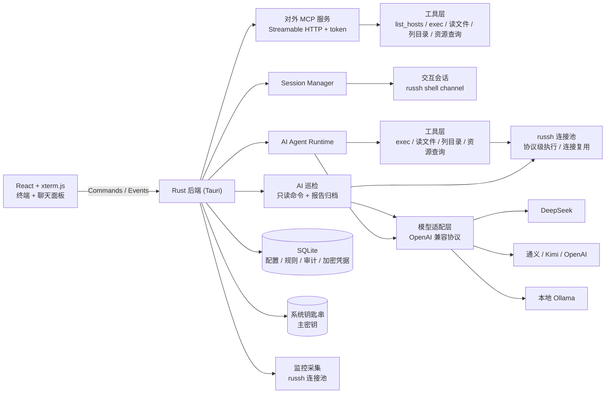

<p align="center">
  
</p>

# buffTerm

> AI Agent Buff 加持的 SSH 管理工具
>
> A desktop SSH manager supercharged by a self-built AI agent — manage servers through natural language, locally.


buffTerm 是一款有 AI Agent Buff 加持的 SSH 管理工具，——内置**自研 AI Agent 编排层**，接入你选择的大模型（DeepSeek、OpenAI、通义千问、Kimi、本地 Ollama 等），用自然语言就能查询状态、排查问题、执行运维。终端高危命令拦截、AI 操作审批与审计全程兜底，所有数据只存本机。

> 🤖 **Agent 编排层完全自研**：核心工具调用循环（SSE 流式解析 → 工具执行 → 结果回填）由本项目手写实现，**不依赖 LangChain / OpenAI Agents SDK / Vercel AI SDK 等框架**——审批拦截、安全策略、审计留痕全部自己掌控。

## 📥 下载

请前往 [GitHub Releases](https://github.com/shaguocgl/buff-term/releases) 下载最新安装包：

- macOS：下载 `.dmg`（Universal，同时支持 Apple Silicon 与 Intel）
- Windows：下载 `.exe`

> ⚠️ macOS 版本目前未做 Apple 公证。凭据以 AES-256-GCM 加密存本机 SQLite，主密钥存系统钥匙串；未签名开发版首次访问钥匙串时可能弹一次系统授权提示，属 macOS 正常行为。

## ✨ 功能特性

### 终端防护

- **回车前拦截高危命令**：基于终端实际命令行判定（覆盖 Tab 补全 / 方向键历史 / 编辑键），命中规则弹窗确认后才执行
- **预置 + 自定义危险规则**：覆盖 `rm -rf`、`mkfs`、`dd if=`、`systemctl stop`、`drop table`、`curl | sh` 等，可删改、可一键恢复
- 全屏应用（vim / htop 等）内自动透传，不误判编辑内容；每次拦截写入审计日志

### AI Agent

- **自研 Agent 编排层**：SSE 流式解析、工具调用循环、审批与审计均为手写实现，无框架依赖
- **russh 协议级执行**：AI 工具调用走独立 SSH 连接（连接复用、known_hosts 校验）
- 多平台配置：DeepSeek / OpenAI / 通义千问 / Kimi / Ollama，单厂商可配多模型
- 工具调用：`exec_command`、`read_file`、`list_dir`、`resource_usage`
- 每台主机独立会话历史，可随时中断 / 清空

### MCP 服务

- **buffTerm 作为 MCP 服务器**：基于 Streamable HTTP + JSON-RPC + token 认证，把勾选的服务器能力开放给 Codex、Claude Desktop 等外部 AI 工具
- 三种权限模式：只读（禁止写操作）/ 管控（危险命令需确认）/ 全部放行
- 启动后自动生成外部 AI 的 MCP 配置 JSON，支持 token 轮换与吊销

### 安全体系

- 三级安全级别：全部审核 / 智能审核（只读自动执行，危险命令需批准）/ 全部放行
- 审计日志：记录每次 AI 工具调用的时间、主机、命令、审批方式、结果摘要
- 输出脱敏：命令输出进入模型前过滤 AK/SK、密钥、口令等敏感信息；私钥与 API Key 永不进入模型上下文

### 监控、巡检与通知

- 监控面板：CPU / 内存 / 磁盘仪表盘 + 负载 + TOP 进程，自动刷新
- AI 巡检：采集只读基线数据生成中文 Markdown 报告，含木马 / 挖矿风险检测
- 一键整改：AI 结合巡检报告生成整改步骤，确认后自动执行，支持步骤编辑与失败重试
- 邮件通知：巡检报告与整改结果可自动发送至已配置的收件人

## 🧱 技术栈

| 层次 | 技术 |
| --- | --- |
| 桌面框架 | Tauri 2（Rust 后端） |
| 前端 | React 19 + TypeScript + xterm.js + Vite |
| 交互终端 / SFTP / AI / MCP / 监控 | russh + russh-sftp（协议级 SSH，全部能力走同一套连接实现） |
| 存储 | SQLite（rusqlite）存配置 / 审计 / 加密凭据 + 系统钥匙串（keyring）存主密钥 |
| AI 接入 | OpenAI 兼容协议，SSE 流式解析，自研工具调用循环 |
| MCP 服务 | 自研 Streamable HTTP + JSON-RPC 服务器（tiny_http） |

## 🏗 架构



## 🚀 快速开始

### 环境要求

- Node.js 20+
- Rust stable（1.97+）
- macOS 需要 Xcode Command Line Tools；Windows 需要 WebView2（一般已内置）

### 开发运行

```bash
npm install
npm run tauri dev
```

### 打包

```bash
npm run tauri build
```

常用安装包快捷命令：

```bash
# macOS DMG
npm run build:mac

# Windows NSIS EXE
npm run build:win
```

产物位置：

```text
src-tauri/target/release/bundle/dmg/
src-tauri/target/release/bundle/nsis/
```

> DMG 需要在 macOS 上构建，EXE 建议在 Windows 上构建；打包前会先执行前端构建与 Rust 编译。未配置代码签名时仍可打包，但系统可能显示安全提示。

## 📚 文档

- [密码存储加密设计](docs/密码存储加密设计.md)：凭据 AES-256-GCM 加密与主密钥管理
- [自研 AI Agent 与权限设计](docs/自研AI-Agent与权限设计.md)：Agent 运行时、审批与安全级别、AI 配置
- [对外 MCP 服务设计](docs/对外MCP服务设计.md)：Streamable HTTP 服务、权限模式与接入
- [AI 巡检整改功能设计](docs/AI巡检整改功能设计.md)：巡检、一键整改与通知（邮件）
- [终端危险命令拦截设计](docs/终端危险命令拦截设计.md)：前端权威命令行 + 后端判定的拦截实现

## 📁 项目结构

```text
src/                   前端（React + xterm.js）
  components/          聊天面板 / 终端 / 弹窗 / 下拉框等
  assets/              buffTerm 界面与文档 logo
src-tauri/src/         Rust 后端
  agent.rs             AI Agent 运行时（流式解析、工具循环、审批、审计）
  safety.rs            安全判定与脱敏（危险命令 / 只读检测 / 输出脱敏）
  guard.rs             终端危险命令拦截（行缓冲状态机 + 规则判定 + 审批）
  util.rs              通用工具函数（时间戳 / 截断 / shell 转义 / token）
  session.rs           SSH 交互会话（russh shell channel）
  russh.rs             russh 连接池（AI / MCP 工具执行，连接复用）
  hosts.rs             主机配置
  ai.rs                AI 平台 / 模型 / 审核规则配置
  credentials.rs       凭据加密（AES-256-GCM）+ 主密钥管理 + 内存缓存
  audit.rs             审计日志查询
  monitor.rs           资源快照采集（CPU / 内存 / 磁盘 / 负载 / TOP 进程）
  alert.rs             通知配置（邮件 SMTP 配置与测试）
  inspection.rs        AI 只读巡检（含木马 / 挖矿风险采集）、报告生成与邮件投递
  remediation.rs       一键整改（整改步骤生成、执行、重试、审计与邮件通知）
  mcp.rs               对外 MCP 服务（HTTP + token + 权限模式）
  sftp.rs              SFTP 文件操作（russh-sftp）
  update.rs            GitHub Release 版本检查
  db.rs                SQLite（主机、AI 配置、规则、审计、巡检与整改）
src-tauri/icons/       桌面应用图标（PNG / ICNS / ICO）
.github/workflows/     GitHub Actions 自动构建与发布
docs/                  设计文档（密码加密 / AI Agent 权限 / MCP 服务 / 巡检整改 / 终端拦截）
```


## 📄 License

[MIT](LICENSE)
