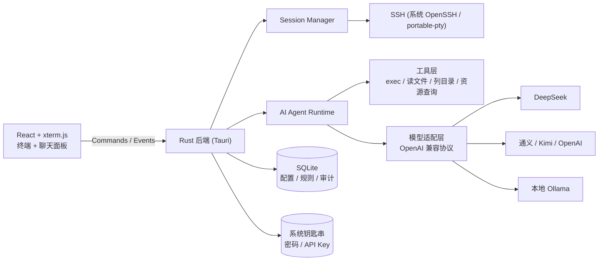

# KeyWisp Agent

> 本地优先的桌面 SSH 管理 + AI Agent 工具
>
> A local-first desktop SSH manager with an AI agent that manages your servers through natural language.


KeyWisp Agent 是一款桌面端 SSH 管理工具，内置**自研的 AI Agent 编排层**：你可以自行配置大模型平台（DeepSeek、OpenAI、通义千问、Kimi、本地 Ollama 等），让 AI 通过自然语言帮你查询和运维远程服务器。所有配置、密钥和审计数据默认只保存在本机。

> 🤖 **Agent 编排层完全自研**：核心工具调用循环（SSE 流式解析 → 工具执行 → 结果回填）由本项目手写实现，**不依赖 LangChain / OpenAI Agents SDK / Vercel AI SDK 等框架**——审批拦截、安全策略、审计留痕全部自己掌控。详细设计见 [实现细节](docs/实现细节.md)。

## ✨ 功能特性

### SSH 基础管理

- 主机配置增删改查（名称、地址、端口、用户名、认证方式、跳板机）
- 密钥 / 密码认证，密码与 API Key 存入系统钥匙串（macOS Keychain / Windows 凭据管理器 / Linux Secret Service）
- 多标签终端会话（xterm.js）、窗口尺寸自适应
- 一键导入 `~/.ssh/config`（HostName / User / Port / IdentityFile / ProxyJump）
- 密码自动填充：连接时检测到密码提示会自动响应，无需手动输入

### AI Agent

- **自研 Agent 编排层**：SSE 流式解析、工具调用循环、审批与审计均为手写实现，无框架依赖，行为完全可控
- 多平台配置：DeepSeek / OpenAI / 通义千问 / Kimi / Ollama（OpenAI 兼容协议）
- 单个厂商支持配置多个模型，聊天窗口底部可随时切换
- 流式回复，Markdown 渲染（代码块 / 表格 / 列表）
- 工具调用：`exec_command`、`read_file`、`list_dir`、`resource_usage`
- 会话内多轮上下文，可随时中断 / 清空

### 安全体系

- 三级安全级别：
  - **全部审核**：每个工具调用都需要人工批准
  - **智能审核**：只读命令自动执行；危险命令（内置规则 + 自定义规则 + 模型判定）需批准
  - **全部放行**：命令直接执行（谨慎使用）
- 自定义智能审核规则：子串匹配，无需通配符，如配置 `rm -rf` 即可命中所有包含该片段的命令
- 审计日志：每次 AI 工具调用的时间、主机、命令、审批方式、结果摘要、耗时，面板内可查
- 私钥与 API Key 永不进入模型上下文，认证由后端注入

## 🧱 技术栈

| 层次 | 技术 |
| --- | --- |
| 桌面框架 | Tauri 2（Rust 后端） |
| 前端 | React 19 + TypeScript + xterm.js + Vite |
| SSH / PTY | 系统 OpenSSH + portable-pty（规划切换 russh） |
| 存储 | SQLite（rusqlite）+ 系统钥匙串（keyring） |
| AI 接入 | OpenAI 兼容协议，SSE 流式解析，自研工具调用循环 |

## 🏗 架构



## 🚀 快速开始

### 环境要求

- Node.js 20+
- Rust stable（1.97+）
- macOS 需要 Xcode Command Line Tools；Windows 需要 WebView2（一般已内置）

### 开发运行

```bash
npm install
npm run tauri dev
```

### 打包

```bash
npm run tauri build
```

## 📖 使用说明

1. **添加主机**：左侧「新建主机」，填写地址、用户名，选择密钥或密码认证（密码会存入系统钥匙串）；也可以点「导入 ~/.ssh/config」一键导入。
2. **连接**：点击主机卡片即可连接，首次连接按终端提示确认主机指纹。
3. **配置 AI**：点击底部「AI Agent」卡片，选择平台预设（如 DeepSeek），填写 API Key 并「测试连接」，保存后即可使用。
4. **AI 对话**：连接服务器后右侧出现聊天面板；底部可切换安全级别（默认智能审核）与当前模型。
5. **操作日志**：侧边栏底部「操作日志」可查看所有 AI 工具调用记录。

## 📚 文档

- [实现细节](docs/实现细节.md)：代码结构、核心实现与踩坑记录

## 📁 项目结构

```text
src/                   前端（React + xterm.js）
  components/          聊天面板 / 终端 / 弹窗 / 下拉框等
src-tauri/src/         Rust 后端
  agent.rs             AI Agent 运行时（流式解析、工具循环、审批、审计）
  session.rs           SSH 会话管理（PTY）
  remote.rs            远程命令执行（密码自动填充、超时、ANSI 清理）
  hosts.rs             主机配置
  ai.rs                AI 平台 / 模型 / 审核规则配置
  credentials.rs       系统钥匙串凭据 + 内存缓存
  audit.rs             审计日志查询
  db.rs                SQLite（主机、AI 配置、规则、审计）
docs/                  实现细节
```

## 🗺 路线图

- [x] M1：桌面骨架 + SSH 连接 + 终端
- [x] M2：SQLite 存储 + 钥匙串 + 导入 ssh config
- [x] M4：AI 平台配置、多模型、Agent 对话、工具调用、审批
- [x] 安全级别、自定义审核规则、审计日志
- [ ] M3：多标签、断线重连、SFTP 文件面板、切换 russh
- [ ] 输出脱敏、MCP 协议支持、团队配置同步

## 🔒 安全说明

- 密码与 API Key 仅存于系统钥匙串，数据库只存引用，不落盘明文；
- AI 会话的认证由后端注入，私钥、密码、API Key 不会进入模型上下文；
- 危险命令默认需要人工批准；审计日志帮助追溯 AI 的每次操作；
- 发布版请使用正式签名（macOS 公证 / Windows 代码签名），以消除开发版钥匙串授权弹窗。

## 🤝 贡献

欢迎提交 Issue 与 Pull Request。

## 📄 License

[MIT](LICENSE)
