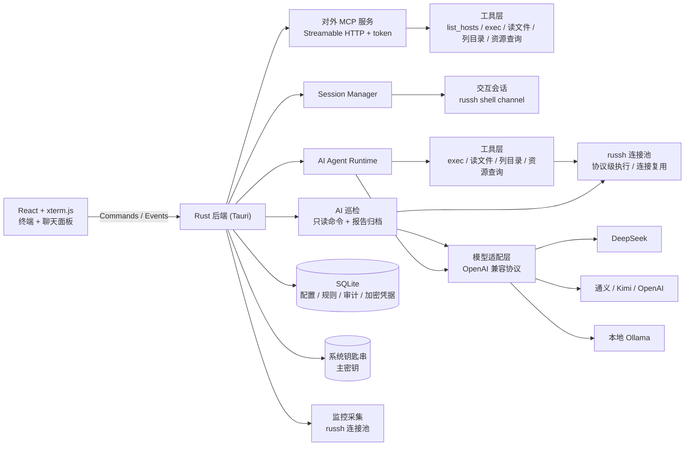

<p align="center">
  
</p>

# buffTerm

> 本地优先的桌面 SSH 管理 + AI Agent 工具
>
> A local-first desktop SSH manager with an AI agent that manages your servers through natural language.


buffTerm 是一款桌面端 SSH 管理工具，内置**自研的 AI Agent 编排层**：你可以自行配置大模型平台（DeepSeek、OpenAI、通义千问、Kimi、本地 Ollama 等），让 AI 通过自然语言帮你查询和运维远程服务器。所有配置、密钥和审计数据默认只保存在本机。

> 🤖 **Agent 编排层完全自研**：核心工具调用循环（SSE 流式解析 → 工具执行 → 结果回填）由本项目手写实现，**不依赖 LangChain / OpenAI Agents SDK / Vercel AI SDK 等框架**——审批拦截、安全策略、审计留痕全部自己掌控。详细设计见 [自研 AI Agent 与权限设计](docs/自研AI-Agent与权限设计.md)。

## 📥 下载

请前往 [GitHub Releases](https://github.com/shaguocgl/buff-term/releases) 下载最新安装包：

- macOS：下载 `.dmg`（Universal，同时支持 Apple Silicon 与 Intel）
- Windows：下载 `.exe`

> ⚠️ macOS 版本目前未做 Apple 公证。凭据以 AES-256-GCM 加密存本机 SQLite，主密钥存系统钥匙串；未签名开发版首次访问钥匙串时可能弹一次系统授权提示，属 macOS 正常行为。

## ✨ 功能特性

### SSH 基础管理

- 主机配置增删改查（名称、地址、端口、用户名、认证方式）
- 密钥 / 密码认证，密码与 API Key 经 AES-256-GCM 加密后存本机 SQLite，主密钥存系统钥匙串（macOS Keychain / Windows 凭据管理器 / Linux Secret Service）
- 多标签终端会话（xterm.js）、窗口尺寸自适应
- 一键导入 `~/.ssh/config`（HostName / User / Port / IdentityFile）
- 密码认证由后端直接注入加密凭据解密结果，不经过终端提示符识别

### 终端防护

- **回车前拦截高危命令**：基于**终端实际命令行**判定（前端 xterm 权威行 + 回显重同步，Tab 补全 / 方向键历史 / 编辑键均覆盖），命中规则弹窗确认后才真正执行
- **预置危险规则**：覆盖删除（`rm -rf`）、格式化 / 分区（`mkfs` / `fdisk` / `dd if=`）、关机重启、服务管理（`systemctl stop`）、防火墙、账户权限、数据库（`drop table`）、强杀进程、Git 强推 / 硬重置、危险管道（`curl | sh`）、覆盖系统文件等，可删改、可一键恢复
- **自定义规则**：子串匹配、大小写不敏感，可随时添加 / 删除
- **审批交互**：批准放行执行、取消发送 Ctrl-U 清行、超时按拒绝处理；审批关闭后自动聚焦终端继续输入
- 全屏应用（vim / htop / less 等）内自动透传，不误判编辑内容；每次拦截写入审计日志（命令脱敏）
- 侧边栏「终端防护」入口配置总开关、规则与恢复预置

### 界面体验

- 日间 / 夜间主题切换：日间纯白、夜间深色，xterm 终端配色跟随主题，偏好自动保存
- 左侧边栏可收起为图标栏：悬停展开主机列表与功能提示，收起状态持久化
- 右侧 AI / 文件 / 监控 / 巡检面板支持鼠标拖拽调整宽度

### AI Agent

- **自研 Agent 编排层**：SSE 流式解析、工具调用循环、审批与审计均为手写实现，无框架依赖，行为完全可控
- **russh 协议级执行**：AI 工具调用走独立 SSH 连接（连接复用、known_hosts 校验、结构化 stdout/退出码）
- 多平台配置：DeepSeek / OpenAI / 通义千问 / Kimi / Ollama（OpenAI 兼容协议）
- 单个厂商支持配置多个模型，聊天窗口底部可随时切换
- 流式回复，Markdown 渲染（代码块 / 表格 / 列表）
- 工具调用：`exec_command`、`read_file`、`list_dir`、`resource_usage`
- 每台主机独立会话历史，切换标签或重开聊天面板自动恢复，可随时中断 / 清空

### MCP 服务

- **buffTerm 作为 MCP 服务器对外提供服务**：基于 Streamable HTTP + JSON-RPC + token 认证
- 把勾选的服务器能力开放给 Codex、Claude Desktop 等外部 AI 工具
- 提供 `list_hosts`、命令执行、文件读取、目录列表、资源查询等 SSH 工具
- 支持三种权限模式：
  - **只读模式**：禁止写操作，适合安全查询场景
  - **管控模式**：系统预置 + 自定义危险命令规则，命中后需人工确认
  - **全部放行**：可执行任意命令，适合完全信任场景
- 启动后自动生成外部 AI 的 MCP 配置 JSON，支持 token 轮换与吊销

### 安全体系

- 三级安全级别：
  - **全部审核**：每个工具调用都需要人工批准
  - **智能审核**：只读命令自动执行；危险命令（内置规则 + 自定义规则 + 模型判定）需批准
  - **全部放行**：命令直接执行（谨慎使用）
- 自定义智能审核规则：子串匹配，无需通配符，如配置 `rm -rf` 即可命中所有包含该片段的命令
- 审计日志：每次 AI 工具调用的时间、主机、命令、审批方式、结果摘要、耗时，面板内可查
- 输出脱敏：命令输出进入模型前过滤 AK/SK、密钥、口令、私钥块等敏感信息
- 私钥与 API Key 永不进入模型上下文，认证由后端注入

### 监控、巡检与通知

- 监控面板：CPU / 内存 / 磁盘仪表盘 + 负载 + TOP 进程，每 5 秒自动刷新
- AI 巡检：采集服务器基线数据后由 AI 生成中文 Markdown 报告；仅允许白名单内的只读命令，支持取消、历史报告与风险等级
- 巡检含「木马 / 挖矿风险」模块：覆盖可疑进程、对外连接、crontab / systemd timer、临时目录可执行文件与 SSH 授权文件变动
- 一键整改：输入整改干预意见后，AI 结合巡检报告生成详细整改步骤；用户确认后自动执行，支持步骤编辑、失败重试、全程审计
- 通知配置：邮件（SMTP）发送渠道配置，支持测试连接
- 巡检报告可自动转为 HTML 并发送至已配置的邮件收件人
- 整改完成后自动发送邮件，包含整改步骤与执行结果
- 版本检查：侧边栏可显示当前版本并检查 GitHub Releases 的最新正式版本，发现更新后可跳转下载

## 🧱 技术栈

| 层次 | 技术 |
| --- | --- |
| 桌面框架 | Tauri 2（Rust 后端） |
| 前端 | React 19 + TypeScript + xterm.js + Vite |
| 交互终端 / SFTP / AI / MCP / 监控 | russh + russh-sftp（协议级 SSH，全部能力走同一套连接实现） |
| 存储 | SQLite（rusqlite）存配置 / 审计 / 加密凭据 + 系统钥匙串（keyring）存主密钥 |
| AI 接入 | OpenAI 兼容协议，SSE 流式解析，自研工具调用循环 |
| MCP 服务 | 自研 Streamable HTTP + JSON-RPC 服务器（tiny_http） |

## 🏗 架构



## 🚀 快速开始

### 环境要求

- Node.js 20+
- Rust stable（1.97+）
- macOS 需要 Xcode Command Line Tools；Windows 需要 WebView2（一般已内置）

### 开发运行

```bash
npm install
npm run tauri dev
```

### 打包

```bash
npm run tauri build
```

常用安装包快捷命令：

```bash
# macOS DMG
npm run build:mac

# Windows NSIS EXE
npm run build:win
```

产物位置：

```text
src-tauri/target/release/bundle/dmg/
src-tauri/target/release/bundle/nsis/
```

> DMG 需要在 macOS 上构建，EXE 建议在 Windows 上构建；打包前会先执行前端构建与 Rust 编译。未配置代码签名时仍可打包，但系统可能显示安全提示。

### 自动发布

推送与应用版本一致的 Git 标签（例如当前版本使用 `v1.0.1`）会触发 GitHub Actions：自动构建 macOS 通用 DMG（Intel + Apple Silicon）与 Windows x64 NSIS 安装包，并上传至同名 GitHub Release。发布前请确保 `package.json`、`src-tauri/tauri.conf.json` 与 `src-tauri/Cargo.toml` 中的版本号一致。

```bash
git tag v1.0.1
git push origin v1.0.1
```

## 📖 使用说明

1. **添加主机**：左侧「新建主机」，填写地址、用户名，选择密钥或密码认证（密码加密后存本机 SQLite）；也可以点「导入 ~/.ssh/config」一键导入。
2. **连接**：点击主机卡片即可连接，首次连接按终端提示确认主机指纹。
3. **配置 AI**：点击底部「AI Agent」卡片，选择平台预设（如 DeepSeek），填写 API Key 并「测试连接」，保存后即可使用。
4. **AI 对话**：连接服务器后右侧出现聊天面板；底部可切换安全级别（默认智能审核）与当前模型。
5. **AI 巡检**：连接服务器后点击终端工具栏的「巡检」，系统采集只读基线数据并生成报告；配置 SMTP 后会自动发送 HTML 报告。报告生成后可直接「一键整改」，输入干预意见、确认步骤后自动执行整改。
6. **MCP 服务**：侧边栏「MCP 服务」勾选要开放的服务器 → 选择权限模式 → 启动，复制生成的配置 JSON 粘贴到 Codex / Claude Desktop 即可接入。
7. **操作日志与更新**：侧边栏底部可查看所有 AI / MCP 工具调用记录；「检查更新」会查询 GitHub 最新正式 Release，发现版本后可跳转下载。
8. **界面**：右上角按钮切换日间 / 夜间主题；侧边栏右上角按钮收起为图标栏（悬停查看详情）；连接后右侧 AI / 文件 / 监控 / 巡检面板可拖拽调宽。

## 📚 文档

- [密码存储加密设计](docs/密码存储加密设计.md)：凭据 AES-256-GCM 加密与主密钥管理
- [自研 AI Agent 与权限设计](docs/自研AI-Agent与权限设计.md)：Agent 运行时、审批与安全级别、AI 配置
- [对外 MCP 服务设计](docs/对外MCP服务设计.md)：Streamable HTTP 服务、权限模式与接入
- [AI 巡检整改功能设计](docs/AI巡检整改功能设计.md)：巡检、一键整改与通知（邮件）
- [终端危险命令拦截设计](docs/终端危险命令拦截设计.md)：前端权威命令行 + 后端判定的拦截实现

## 📁 项目结构

```text
src/                   前端（React + xterm.js）
  components/          聊天面板 / 终端 / 弹窗 / 下拉框等
  assets/              buffTerm 界面与文档 logo
src-tauri/src/         Rust 后端
  agent.rs             AI Agent 运行时（流式解析、工具循环、审批、审计）
  safety.rs            安全判定与脱敏（危险命令 / 只读检测 / 输出脱敏）
  guard.rs             终端危险命令拦截（行缓冲状态机 + 规则判定 + 审批）
  util.rs              通用工具函数（时间戳 / 截断 / shell 转义 / token）
  session.rs           SSH 交互会话（russh shell channel）
  russh.rs             russh 连接池（AI / MCP 工具执行，连接复用）
  hosts.rs             主机配置
  ai.rs                AI 平台 / 模型 / 审核规则配置
  credentials.rs       凭据加密（AES-256-GCM）+ 主密钥管理 + 内存缓存
  audit.rs             审计日志查询
  monitor.rs           资源快照采集（CPU / 内存 / 磁盘 / 负载 / TOP 进程）
  alert.rs             通知配置（邮件 SMTP 配置与测试）
  inspection.rs        AI 只读巡检（含木马 / 挖矿风险采集）、报告生成与邮件投递
  remediation.rs       一键整改（整改步骤生成、执行、重试、审计与邮件通知）
  mcp.rs               对外 MCP 服务（HTTP + token + 权限模式）
  sftp.rs              SFTP 文件操作（russh-sftp）
  update.rs            GitHub Release 版本检查
  db.rs                SQLite（主机、AI 配置、规则、审计、巡检与整改）
src-tauri/icons/       桌面应用图标（PNG / ICNS / ICO）
.github/workflows/     GitHub Actions 自动构建与发布
docs/                  设计文档（密码加密 / AI Agent 权限 / MCP 服务 / 巡检整改 / 终端拦截）
```


## 🔒 安全说明

- 密码与 API Key 以 AES-256-GCM 加密存本机 SQLite，主密钥存系统钥匙串，数据库文件不含明文；
- AI 会话的认证由后端注入，私钥、密码、API Key 不会进入模型上下文；
- 危险命令默认需要人工批准；审计日志帮助追溯 AI 的每次操作；
- 发布版请使用正式签名（macOS 公证 / Windows 代码签名），以消除开发版钥匙串授权弹窗。

## 🤝 贡献

欢迎提交 Issue 与 Pull Request。

## 📄 License

[MIT](LICENSE)
