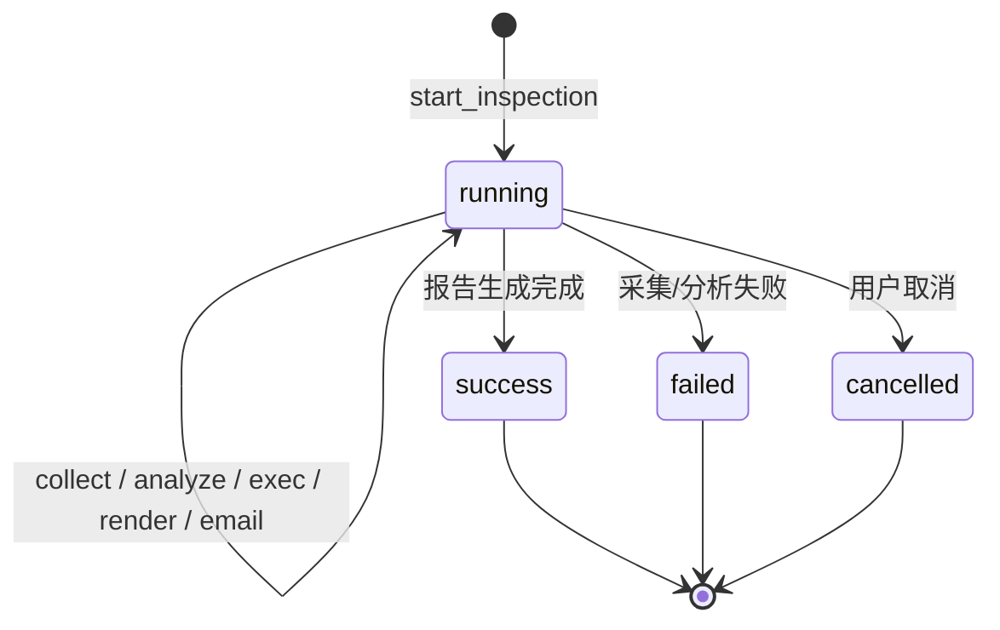
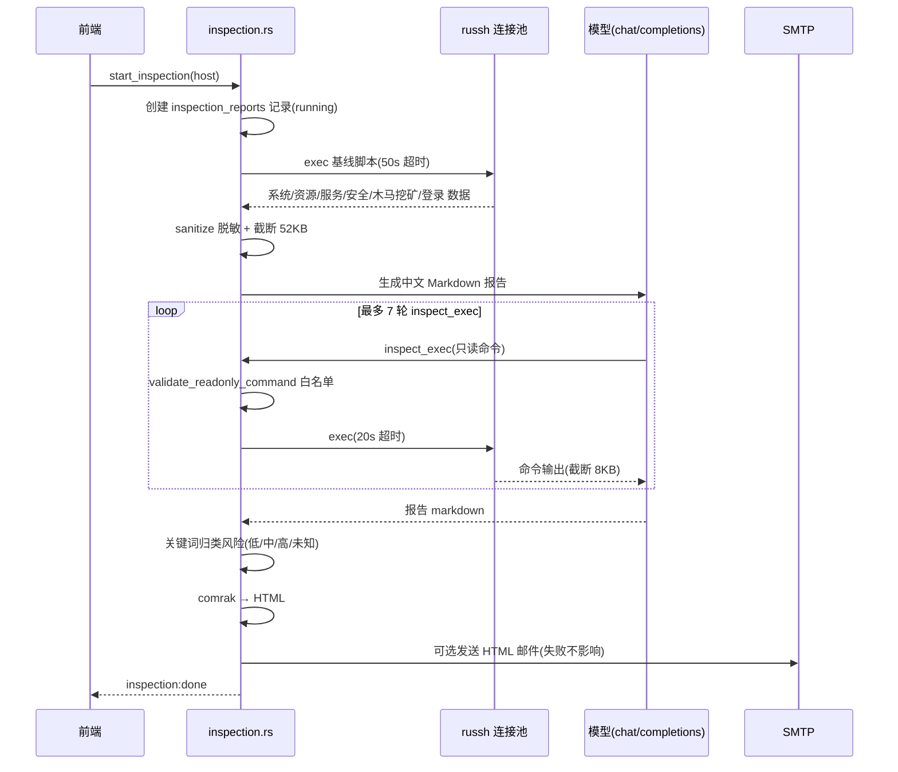
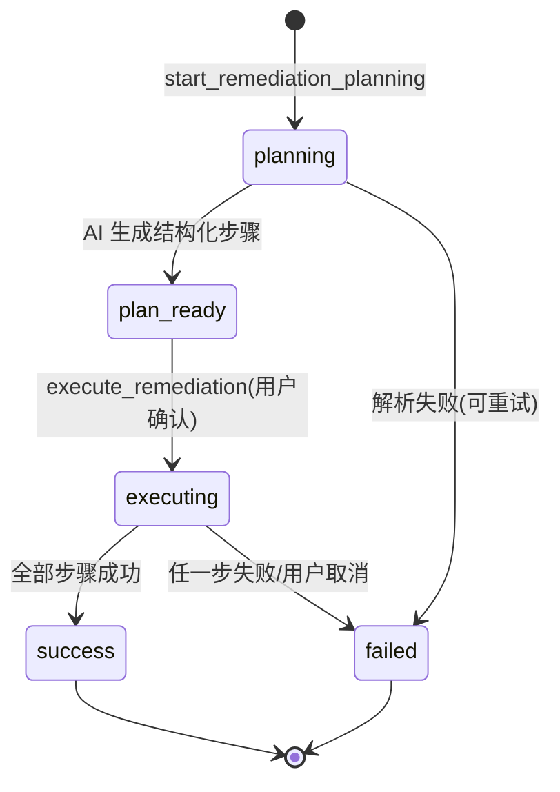
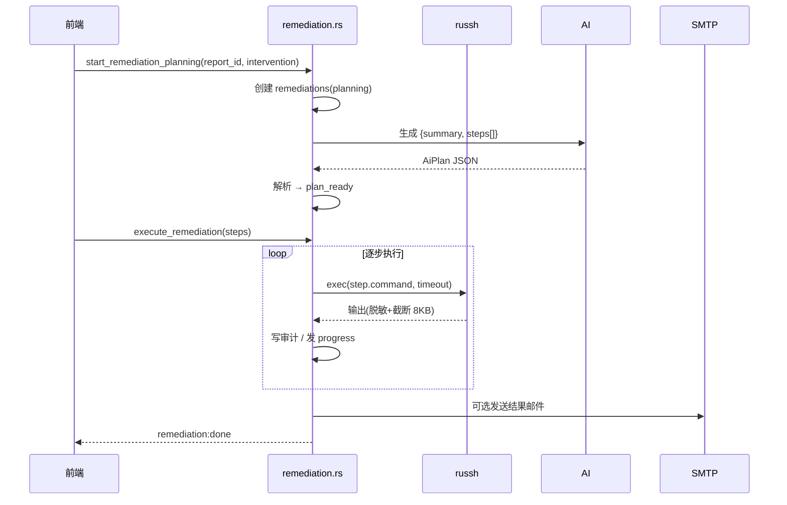

# AI 巡检整改功能设计

> 连接服务器后一键采集基线数据，由 AI 生成中文巡检报告（含木马 / 挖矿风险模块）；报告确认后可一键生成并执行整改步骤，全程审计与邮件通知。

## 1. 巡检状态机



任务通过 `inspection:progress` / `inspection:done` / `inspection:error` 事件向前端报告阶段与结果；取消使用原子标志，在采集、分析与工具调用间检查。

## 2. 巡检流程



基线采集内容：系统 / 资源 / 服务 / 安全信息、fail2ban 实际配置（`jail.local` / `jail.conf` / `jail.d/*` 的 maxretry / bantime / findtime）、木马 / 挖矿风险（可疑进程特征 xmrig / kdevtmpfsi / kinsing、`ss -tunp` 对外连接、用户与系统 cron、systemd timers、`/tmp` `/dev/shm` `/var/tmp` 可执行文件、最近变动的 `authorized_keys`）。

## 3. 只读白名单（inspect_exec）

`inspect_exec` 只接受白名单命令，拒绝管道、重定向、命令替换与写操作关键词。校验逻辑（真实代码）：

```rust
// inspection.rs：模型工具调用循环中的只读校验
if name != "inspect_exec" || command.trim().is_empty() {
    messages.push(tool_message(&id, "只读检查已拒绝：工具名或命令参数无效"));
    continue;
}
if let Err(reason) = validate_readonly_command(command) {
    messages.push(tool_message(&id, &format!("只读检查已拒绝: {reason}")));
    continue;
}
emit_progress(app, report_id, "exec", command);
let out = app.state::<RusshManager>()
    .exec(&host, command, Duration::from_secs(20))   // 每条动态检查限时 20s
    .await
    .map(|o| truncate_output(&o.text, 8000))
    .unwrap_or_else(|e| format!("执行失败: {e}"));
messages.push(tool_message(&id, &out));
```

白名单允许如 `df`、`free`、`journalctl`、`docker` 等只读命令；`validate_readonly_command` 会拒绝 `|` 管道、`>` 重定向、`$(...)` / 反引号命令替换及写操作关键词。报告提示词要求整改建议严格基于采集到的真实数值，缺数据时只能标注“未采集，建议人工确认”，木马 / 挖矿判断只报可疑点和证据。

## 4. 一键整改



整改步骤数据结构（`AiPlan`，规划阶段不执行任何命令）：

```rust
#[derive(Deserialize)]
struct AiPlan {
    summary: Option<String>,
    steps: Vec<AiPlanStep>,
}

#[derive(Deserialize)]
struct AiPlanStep {
    description: Option<String>,
    command: String,
    timeout_secs: Option<u64>,
}
```

执行流程（`execute_remediation`）：

- 用户在 `plan_ready` 状态可编辑 / 删除步骤；确认后按顺序执行，单步超时默认 60 秒（限制 5–600 秒），输出脱敏并截断至 8000 字符；
- 每条整改命令写入 `audit_logs`（`tool_name=remediation`、`approval=confirmed`），任一步失败立即停止并置 `failed`，步骤之间检查取消标志；
- 失败或取消后可 `retry_remediation` 重新执行；整改成功或失败后，若已配置 SMTP，自动发送包含步骤与结果的 HTML 邮件；
- 事件：`remediation:progress` / `remediation:done` / `remediation:error`，进度事件含 `step_index` / `total`。



## 5. 通知（邮件）

- 仅支持**邮件（SMTP）渠道**：SMTP 服务器 / 端口 / 加密（STARTTLS / SSL / 无）/ 用户名 / 密码 / 发件人 / 收件人，配置存 `settings` 表 `alert_settings` JSON 键；
- `test_alert_settings` 用传入设置直接发测试邮件，未保存也可测试；
- 发送基于 `lettre`：`SmtpTransport::builder_dangerous` + `Credentials`，按 `smtp_tls` 选择 Wrapper（SSL）/ Required（STARTTLS）/ 明文；
- 巡检报告与整改结果自动投递；**邮件发送失败不影响巡检 / 整改任务本身**。
