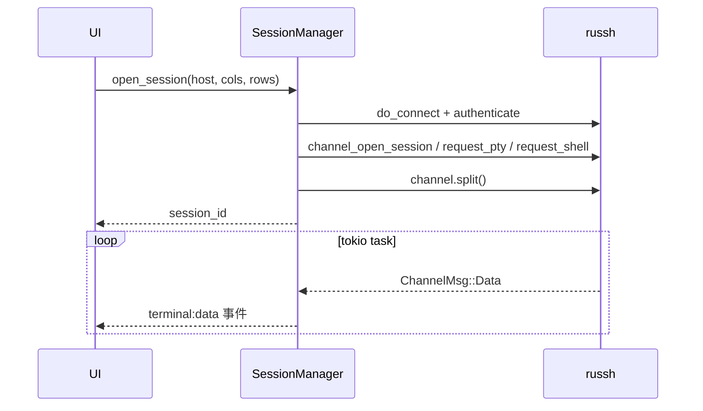

# KeyWisp Agent 实现细节

> 本文档描述当前代码库的最新实现方式。
> 更新日期：2026-08-13

---

## 1. 模块地图

```text
src-tauri/src/         Rust 后端
  lib.rs               应用入口：状态注册、命令注册、MCP 服务自动恢复
  models.rs            数据模型（Host / AiProvider / AiModel / AiRule / McpService / AuditLog）
  db.rs                SQLite：建表、读写、数据迁移
  hosts.rs             主机配置 CRUD、ssh config 导入
  credentials.rs       系统钥匙串（密码 / API Key）+ 内存缓存
  session.rs           SSH 交互会话（russh shell channel + 事件流）
  russh.rs             russh 连接池（AI / MCP 工具执行，连接复用）
  agent.rs             AI Agent 运行时（自研：流式解析、工具循环、审批、审计）
  ai.rs                AI 平台 / 多模型 / 审核规则配置
  audit.rs             审计日志查询
  monitor.rs           资源快照采集（CPU / 内存 / 磁盘 / 负载 / TOP 进程）
  alert.rs             告警渠道：邮件（SMTP）配置与测试连接
  mcp.rs               对外 MCP 服务（Streamable HTTP + token + 权限模式）
  sftp.rs              SFTP 文件操作（russh-sftp）
  sshconfig.rs         ~/.ssh/config 解析

src/                   前端（React + TypeScript + xterm.js）
  App.tsx              布局与状态（主机、会话、AI 配置、MCP 服务、审批弹窗）
  api.ts               Tauri invoke / 事件监听封装
  components/
    TerminalView.tsx   终端（先监听后连接，杜绝丢首屏）
    ChatPanel.tsx      聊天面板（消息配对、流式、工具审批卡片）
    AIConfigModal.tsx  AI 平台 / 多模型 / 审核规则配置
    McpServiceModal.tsx MCP 服务配置（卡片勾选 / 权限模式 / 配置 JSON）
    McpApprovalModal.tsx 外部 AI 危险命令审批弹窗
    AuditLogModal.tsx  操作日志面板
    MonitorPanel.tsx   监控面板
    HostForm.tsx       新建 / 编辑主机（含密码保存）
    AlertModal.tsx     告警渠道（邮件 SMTP 配置与测试）
    Select.tsx         自研下拉框
    Modal.tsx / Toast.tsx / Icons.tsx
```

---

## 2. 数据层

### 2.1 SQLite（db.rs）

`PRAGMA journal_mode = WAL`，当前 8 张表：

| 表 | 用途 | 关键字段 |
| --- | --- | --- |
| `hosts` | 主机配置 | id, name, address, port, username, auth_type, key_path, notes, created_at |
| `ai_providers` | AI 平台（厂商） | id, name, base_url, protocol, enabled, created_at |
| `ai_models` | 平台下多个模型 | id, provider_id, label, model, is_active, sort |
| `ai_rules` | 内置 AI 智能审核自定义规则 | id, pattern, enabled, created_at |
| `audit_logs` | 审计日志 | 见 §4.6 |
| `settings` | 键值配置 | key, value（当前存 `alert_settings` 邮件配置 JSON） |
| `mcp_service` | 对外 MCP 服务配置（单行） | enabled, host_ids(JSON), permission_mode, token, port, updated_at |
| `mcp_rules` | MCP 管控模式自定义规则 | id, pattern, enabled, created_at |

### 2.2 数据迁移

- **hosts.json → SQLite**：首次启动若 `hosts` 表为空且存在旧版 `hosts.json`，逐条导入；
- **单模型 → 多模型**：`ai_providers.model` 有值而 `ai_models` 为空时，为每个平台生成一条激活模型记录；
- **功能收敛**：历史遗留的 `alerts` / `inspections` / `inspection_runs` 表在启动时 `DROP`（阈值告警与定时巡检已下线），`mcp_servers`（入站 MCP）同样移除。

### 2.3 凭据存储（credentials.rs）

- 使用 `keyring`（macOS Keychain / Windows 凭据管理器 / Linux Secret Service），service 固定为 `com.keywisp.agent`，account 为 `{kind}:{id}`（`password:主机id` / `apikey:平台id`）；
- 数据库只存引用，**明文凭据不落盘**；
- **内存缓存**：每个条目每次应用启动只访问一次钥匙串，之后读内存缓存。原因：未签名的开发版二进制每次编译签名都变化，钥匙串 ACL 匹配不上会反复弹授权窗；缓存把弹窗降到“每启动每条目一次”。

---

## 3. SSH 层

### 3.1 统一 russh 执行通道

| 场景 | 通道 | 特点 |
| --- | --- | --- |
| 交互终端 | russh shell channel | 请求 PTY + shell，`Channel::split()` 并发收发 |
| AI 工具 / MCP 服务 | russh 连接池（`RusshManager`） | 协议级 exec、known_hosts 校验、按主机复用连接 |
| SFTP | russh-sftp（`SftpSession`） | 子系统 SFTP，列表 / 上传 / 下载 / 删除 / 重命名 |
| 监控采集 | russh 连接池（`RusshManager`） | 复用 exec 通道，无系统 `ssh` 进程 |

### 3.2 交互会话（session.rs）



- 认证由 `do_connect` 在打开通道前完成：密码走钥匙串缓存，密钥走 `IdentityFile`；
- `channel.split()` 把读 / 写两半分开，一个 `tokio::task` 同时处理 `terminal:data`、用户输入和窗口 resize；
- `session_input` 通过 `ChannelWriteHalf::data_bytes` 写入，`session_resize` 通过 `window_change` 调整尺寸；
- 收到 `ChannelMsg::Close` 或通道 EOF 时，发出 `session:status = exited` 并从会话表移除。

### 3.3 SFTP（sftp.rs）

- 每个命令通过 `do_connect` 新建 SSH 会话，`request_subsystem(true, "sftp")` 后创建 `russh_sftp::client::SftpSession`；
- 文件列表用 `read_dir` + `FileAttributes` 生成为 `ls -la` 兼容文本，前端解析逻辑无需调整；
- 上传 / 下载使用 `tokio::io::copy` 流式传输，避免把整个文件读入内存；
- 删除会先 `metadata` 判断目录 / 文件，分别调用 `remove_dir` / `remove_file`；
- 超时按操作类型控制：列表 / 删除 / 新建 / 重命名 20 秒，上传 / 下载 120 秒。

### 3.4 russh 连接池（russh.rs）

- 按主机 id 缓存 `Handle`，执行时先复用，失败自动丢弃重连（`Inactivity timeout` 等异常场景）；
- `Config` 显式关闭 `inactivity_timeout`、keepalive 15s/3 次，避免连接刚建立就被回收；
- 密码认证从钥匙串读取（带内存缓存），密钥认证支持 `IdentityFile`；
- 连接参数由代码显式构造，不读取系统 ssh config，也不通过系统 `ssh`/`sftp` 进程执行；
- 输出结构化为 `ExecResult { text, exit_code, timed_out }`，供 agent 与 MCP 层统一处理。

---

## 4. AI Agent 运行时（agent.rs）——自研实现

### 4.0 自研，而不是套用 Agent 框架

核心的 Agent 循环（`run_agent_loop`）是**手写的**，没有引入 LangChain、OpenAI Agents SDK、Vercel AI SDK 等框架。原因：

1. **工具调用循环本身很简单**：一次请求 → 解析出工具调用 → 执行 → 结果回填 → 再来一轮，骨架只需几百行；
2. **产品级控制点必须插在循环内部**：审批拦截、审计日志、输出脱敏、按会话隔离历史、模型热切换——这些都需要在“模型返回 → 工具执行”之间精确拦截，自研可以直接在关键路径上写代码；
3. **只依赖 OpenAI 兼容协议**：标准 `chat/completions + tools`，因此 DeepSeek、通义、Kimi、Ollama、OpenAI 天然通用；
4. **可控与可调试**：流解析、工具归组、审批等待、错误提取都是自己的代码，出问题可直接定位。

这里的“自研”指**自研 Agent 编排层**，底层仍调用各家模型的 chat completions 接口。

### 4.1 设计思想

- **循环即状态机**：一轮 = 请求 → 流式解析 → 判定 → 审批 → 执行 → 回填 → 再请求，直到模型不再调用工具；
- **流式优先**：SSE 增量解析，文本边到边显示，工具调用按 `index` 归组、增量拼接 `arguments`；
- **审批是硬拦截，不是软约束**：工具执行前用 `mpsc` 通道同步等待用户决定，模型无法绕过；拒绝后把“用户拒绝执行”作为工具结果回填，让模型调整方案；
- **可观测**：每个工具调用都落审计日志（命令、审批方式、结果、耗时）；
- **模型无关 + 配置驱动**：模型名每次请求都从激活配置读取，会话内切换立刻生效；
- **容错**：单会话 12 轮上限、审批 10 分钟超时、流尾残留数据处理、非 2xx 响应提取 `error.message`；
- **工具名契约**：系统提示词明确工具名白名单；解析层对模型漏填名称做参数推断（`command` → `exec_command`、`path` → `read_file`），并对常见别名归一化（`ls/listdir/list_directory` → `list_dir` 等），降低模型幻觉导致的调用失败。

### 4.2 代码案例（真实摘录）

**① 工具循环骨架**（`run_agent_loop`，已精简）

```rust
loop {
    iterations += 1;
    if iterations > 12 { /* 轮次上限，防止失控 */ }
    if let Ok(Control::Cancel) = rx.try_recv() { return Ok(()); }   // 用户点停止

    // 1. 请求：历史 + 工具 schema 发给模型
    let resp = client.post(url).bearer_auth(api_key)
        .json(&json!({ "model": model, "messages": history,
                       "stream": true, "tools": tools_schema() }))
        .send().await?;

    // 2. 解析 SSE，得到文本与工具调用（按 index 归组）
    let (content, tool_calls) = parse_stream(resp).await?;

    if tool_calls.is_empty() {
        history.push(json!({ "role": "assistant", "content": content }));
        app.emit("ai:done", ...);
        return Ok(());                       // 模型直接回答，本轮结束
    }
    history.push(assistant_with_tool_calls(content, &tool_calls));

    // 3. 逐个工具：审批 → 执行 → 回填 → 审计
    for call in tool_calls {
        if need_approval(call, permission_mode, &danger_rules) {
            wait_approval(&rx, &call)?;     // 硬拦截，见案例③
        }
        let output = execute_tool(host, &call.name, &call.args);
        insert_audit(db, session_id, host, &call, ...);  // 每个调用都留痕
        history.push(tool_result(call.id, output));
    }
    // 4. 带着工具结果进入下一轮，让模型总结
}
```

**② SSE 增量解析**（`apply_delta`，真实代码节选）

```rust
fn apply_delta(delta: &Value, content: &mut String,
               tool_calls: &mut HashMap<usize, ToolCallAcc>, ...) {
    if let Some(t) = delta["content"].as_str() {
        content.push_str(t);                      // 文本增量 → 前端流式展示
        app.emit("ai:stream", AiStream { session_id, delta: t.to_string() });
    }
    if let Some(calls) = delta["tool_calls"].as_array() {
        for call in calls {
            let index = call["index"].as_u64().unwrap_or(0) as usize;
            let acc = tool_calls.entry(index).or_default();
            if let Some(id) = call["id"].as_str()      { acc.id = id.into(); }
            if let Some(name) = call["function"]["name"].as_str() { acc.name = name.into(); }
            if let Some(args) = call["function"]["arguments"].as_str() {
                acc.args.push_str(args);              // arguments 是增量 JSON 片段
            }
        }
    }
}
```

**③ 审批等待（硬拦截）**（真实代码节选）

```rust
let decision = loop {
    match rx.recv_timeout(Duration::from_secs(600)) {
        Err(_) => return Err("等待审批超时".into()),
        Ok(Control::Cancel) => return Ok(()),   // 用户中断
        Ok(Control::Approve { tool_call_id, allow })
            if tool_call_id == acc.id => break allow,
        Ok(Control::Approve { .. }) => continue, // 丢弃过期审批
    }
};
```

前端按钮 → `agent_approve(session_id, tool_call_id, allow)` → 通道投递；后端收到匹配的 `tool_call_id` 才放行，避免多工具调用时审批错位。

**④ 智能审核判定**（真实代码节选）

```rust
let need_approval = match permission_mode {
    "all"  => true,                              // 全部审核
    "none" => false,                             // 全部放行
    _ => {                                       // 智能审核
        if acc.name != "exec_command" { false }  // 只读工具自动执行
        else {
            let marked = args["requires_approval"].as_bool().unwrap_or(false);
            let c = command.to_ascii_lowercase();
            marked                                       // 模型自判危险
                || is_dangerous(command)                 // 内置危险模式
                || danger_rules.iter().any(|p| c.contains(&p.to_ascii_lowercase()))
        }                                              // 用户自定义规则（子串匹配）
    }
};
```

**⑤ 身份提示词注入**（`system_prompt`，节选）

```rust
format!(
    "你是 KeyWisp Agent……\n\
     当前由 {} 平台提供能力，当前配置的底层模型是 {}。\n\
     ……\n\
     5. 身份说明：当用户询问“你是什么模型/你由谁开发”时，如实回答你由 {} 驱动、
        配置的模型为 {}；不要声称自己是任何其他 AI 助手（如 ChatGPT、Claude、Gemini 等），
        也不要编造版本号或开发厂商信息。",
    provider.name, model, provider.name, model
)
```

### 4.3 请求流程

1. `agent_chat(session_id, message, permission_mode)`：
   - 校验安全级别为 `all` / `smart` / `none`；
   - 取该会话的主机、启用的 AI 平台、**激活模型**（`ai_models.is_active`，无激活则取第一个）、钥匙串里的 API Key；
   - 取自定义审核规则；按会话恢复/新建历史（首轮注入系统提示词）；
2. 循环调用 OpenAI 兼容接口（`POST {base_url}/chat/completions`，`stream: true`）：
   - 解析 SSE `data:` 行，累积 `content` 与按 index 归组的 `tool_calls`（id / name / arguments 增量拼接）；
   - 处理流结束时缓冲区残留的未换行数据，避免最后一段内容丢失；
   - 无工具调用 → 写入历史，发 `ai:done`，结束；有工具调用 → 审批 → 执行 → 回填 → 进入下一轮；
3. 单会话最多 **12 轮**工具调用，超限报错停止。

### 4.4 审批与安全级别

| 级别 | 行为 |
| --- | --- |
| `all`（全部审核） | 每个工具调用都等待用户批准 |
| `none`（全部放行） | 直接执行，不弹审批 |
| `smart`（智能审核） | 只读工具自动执行；`exec_command` 满足任一条件则需审批 |

智能审核判定（三者 OR）：

1. 模型在工具参数里标记 `requires_approval: true`；
2. 命令命中内置危险模式（`rm -rf`、`mkfs`、`iptables`、`systemctl stop/restart/disable/mask`、`shutdown`、`reboot`、`chmod -R`、`dd if=`、`drop database` 等）；
3. 命令包含任意自定义规则（**不区分大小写的子串匹配**，无需通配符）。

### 4.5 工具集

| 工具 | 参数 | 说明 |
| --- | --- | --- |
| `exec_command` | command, timeout_secs, requires_approval | 执行 shell 命令 |
| `read_file` | path | `cat` 读文件 |
| `list_dir` | path | `ls -lah` 列目录 |
| `resource_usage` | — | df / free / uptime / TOP 进程汇总 |

命令经单引号安全转义（`'` → `'\''`）后交给 russh 执行；输出统一脱敏（AK/SK、密钥、口令、私钥块）并截断（头 8000 + 尾 4000）后回填模型。

### 4.6 审计日志（agent.rs + audit.rs）

每个工具调用结束时写一条 `audit_logs`：

- 时间戳、会话 ID、主机 id / 标签、工具名、命令摘要（截断 500 字符）；
- 安全级别、审批方式（`auto` / `approved` / `denied`）、执行状态（`executed` / `denied` / `error`）；
- 结果摘要（截断 300 字符）、耗时（ms）。

前端「操作日志」面板通过 `list_audit_logs` 拉取最近 100 条。

---

## 5. 对外 MCP 服务（mcp.rs）

KeyWisp 作为 MCP 服务器，把用户**勾选的服务器**能力开放给外部 AI（Codex、Claude Desktop 等），采用自研 Streamable HTTP 实现（tiny_http，无框架依赖）。

### 5.1 生命周期与鉴权

- **按需启动**：默认不监听；用户在「MCP 服务」弹窗勾选主机并点“启动服务”时才监听 `127.0.0.1`（默认 48123，被占用则随机端口）；
- 启动时生成随机 token（64 位 hex），存 `mcp_service.token`；每次请求校验 `Authorization: Bearer <token>` 或 `?access_token=`，失败返回 401；
- 支持“吊销并重新生成 token”（`rotate_mcp_token`）；应用启动且配置 enabled 时自动恢复监听；
- 关闭服务（`enabled=false`）通过 oneshot 通知监听线程退出，端口释放。

### 5.2 协议实现

- `POST /mcp`：JSON-RPC 2.0 请求，支持 `initialize`（协议版本 `2025-03-26`、`serverInfo.name = keywisp-ssh`）、`notifications/initialized`、`ping`、`tools/list`、`tools/call`；
- `GET /mcp`：SSE 事件流（心跳保活）。tiny_http 的 `respond` 会先把响应写入 BufWriter，无限流 body 阻塞读取时 header 永远无法 flush，因此 SSE 用 `request.into_writer()` 手动写响应头并立即 flush；
- 工具调用同步返回 `{ content: [{ type: "text", text }], isError }`；错误以 `isError: true` 返回，避免中断外部 AI 的会话。

### 5.3 工具集（host 参数化）

| 工具 | 参数 | 说明 |
| --- | --- | --- |
| `list_hosts` | — | 仅返回服务启用时勾选的主机（id / name / address / port / username / auth_type） |
| `resource_usage` | host | 磁盘 / 内存 / 负载 / TOP 进程 |
| `read_file` | host, path | 读文件 |
| `list_dir` | host, path? | 列目录 |
| `exec_command` | host, command, timeout_secs? | 执行命令（受权限模式约束） |

- `host` 支持 id / name / address 三种匹配；未勾选的主机直接拒绝（“未授权给 MCP 服务”）；
- 与内置 AI 不同，外部 AI 不依赖“当前已连接主机”，每次调用按需通过 russh 连接池执行；
- 命令输出复用 `agent::sanitize` 脱敏与 12KB 截断，外部调用同样写入审计日志（`permission_mode = mcp`）。

### 5.4 权限模式

| 模式 | 存储值 | 行为 |
| --- | --- | --- |
| 只读模式 | `readonly` | 允许查看类命令；**写操作被拒绝**（`is_write_operation`） |
| 管控模式 | `confirm` | **仅当命令命中自定义管控规则**（`mcp_rules`，子串匹配）时弹窗审批 |
| 全部放行 | `allow` | 任意命令直接执行，仅审计 |

只读模式的写操作检测（`is_write_operation`）：

1. 命中内置危险命令表（rm / mkfs / 关机等）→ 视为写操作；
2. 重定向写文件：命令清理掉 `2>/dev/null`、`2>&1` 等无害写法后仍含 `>` / `>>` → 拒绝；
3. 写类命令关键词：touch / mv / cp / chmod / chown / sed -i / apt / yum / pip install / curl -o / scp / tar -x / git push / docker 等 → 拒绝。

管控模式的审批桥接：

```rust
// mcp.rs：危险命令命中 → 注册 oneshot → 发前端事件 → 等待决定
let registry = app.state::<ApprovalRegistry>();
let rx = registry.register(request_id.clone());
app.emit("mcp:approval-request", json!({ "request_id", "host", "command", ... }));
let approved = tokio::time::timeout(Duration::from_secs(600), rx).await?;
```

前端 `McpApprovalModal` 展示主机与命令，用户点“批准 / 拒绝”后调用 `mcp_approve(request_id, allow)`，后端通过 oneshot 放行或终止；拒绝时写 `denied` 审计日志。

### 5.5 接入配置

开启后弹窗自动生成并复制：

```json
{
  "mcpServers": {
    "keywisp-ssh": {
      "type": "http",
      "url": "http://127.0.0.1:48123/mcp",
      "headers": { "Authorization": "Bearer <token>" }
    }
  }
}
```

---

## 6. AI 配置（ai.rs）

- 平台 CRUD：name / base_url / protocol（默认 `openai-compatible`）/ enabled / API Key；
- **多模型**：每个平台持有 `ai_models` 列表，保存时全量替换；`set_active_ai_model` 把目标模型置为唯一激活项（先全部置 0 再置 1）；
- **测试连接**：非流式请求 `{base_url}/chat/completions`（`max_tokens: 1`），返回成功或带错误详情的提示（401 / 429 等）；
- 预置平台：DeepSeek、OpenAI、通义千问、Kimi、Ollama，各带两个默认模型，用户可自由增删改。

---

## 7. 监控面板（monitor.rs）

- `monitor_snapshot` 通过 `RusshManager::exec` 在目标主机执行固定脚本，解析出 CPU / 内存 / 磁盘 / 负载 / TOP 进程；
- 前端 `MonitorPanel` 每 5 秒自动刷新，展示仪表盘与进程列表。

---

## 8. 告警渠道（alert.rs）

- 当前仅支持**邮件（SMTP）渠道**：保存 SMTP 服务器 / 端口 / 加密（STARTTLS / SSL / 无）/ 用户名 / 密码 / 发件人 / 收件人；
- `test_alert_settings` 用传入设置直接发一封测试邮件，未保存也可测试；
- 发送实现基于 `lettre`：`SmtpTransport::builder_dangerous` + `Credentials`，按 `smtp_tls` 选择 Wrapper（SSL）/ Required（STARTTLS）/ 明文；
- 配置存 `settings` 表 `alert_settings` JSON 键。

---

## 9. 前端实现

### 9.1 终端：先监听后连接（TerminalView.tsx）

固定流程：

1. 挂载 xterm.js 并 fit；
2. `await` 注册 `terminal:data` 与 `session:status` 监听；
3. 再调用 `open_session`；
4. 连接成功后回调 `onOpened(sessionId)`，App 才渲染聊天面板。

卸载时自动 `close_session`，避免会话泄漏。

### 9.2 聊天消息配对（ChatPanel.tsx）

- 每次发送创建两条消息：用户消息 + **专属 AI 占位消息**，并把占位 ID 记入 `activeAssistantId`；
- 流式内容、工具卡片、错误提示只更新该 ID，杜绝“回答续写进上一轮气泡”；
- 空占位在收到内容前不渲染；底部控制条：安全级别（localStorage 持久化）+ 模型切换；
- AI 回复经 `react-markdown + remark-gfm` 渲染（代码块 / 表格 / 列表）。

### 9.3 MCP 服务弹窗（McpServiceModal.tsx）

- 直接展示主机卡片列表（圆形勾选 / 头像 / 地址 / 认证标签），一行一张，勾选高亮；
- 权限模式 Select + 说明；管控模式下内联“自定义管控命令”规则区（添加 / 删除、子串匹配提示）；
- 底部：未启动显示“启动服务”；运行中显示“关闭服务”，配置变更时显示“保存更改”（实时生效，无需重启）；
- 运行中显示配置 JSON（自动生成）与运行状态绿点，支持复制与吊销 token。

### 9.4 自研下拉框（Select.tsx）

- 按钮 + 绝对定位菜单，箭头旋转动画、选项选中打勾；
- 键盘支持 `↑`/`↓`/`Enter`/`Esc`，点击外部关闭；
- `select-up` 类使聊天底部的下拉向上弹出，避免被窗口底部截断。

---

## 10. 前后端接口

### 10.1 Tauri Commands

| 模块 | 命令 |
| --- | --- |
| 主机 | `list_hosts` `create_host` `update_host` `delete_host` `import_ssh_config` `save_host_credentials` `test_host_connection` |
| 会话 | `open_session` `close_session` `session_input` `session_resize` |
| AI 配置 | `list_ai_providers` `save_ai_provider` `delete_ai_provider` `set_active_ai_model` `set_active_ai_provider` `test_ai_provider` |
| 审核规则 | `list_ai_rules` `add_ai_rule` `delete_ai_rule` |
| Agent | `agent_chat` `agent_approve` `agent_cancel` `agent_reset` |
| 审计 | `list_audit_logs` |
| SFTP | `sftp_list` `sftp_download` `sftp_upload` `sftp_delete` `sftp_mkdir` `sftp_rename` |
| 监控 | `monitor_snapshot` |
| 告警渠道 | `get_alert_settings` `save_alert_settings` `test_alert_settings` |
| MCP 服务 | `get_mcp_service` `save_mcp_service` `rotate_mcp_token` `mcp_approve` `list_mcp_rules` `add_mcp_rule` `delete_mcp_rule` |

**注意**：Tauri 2 会把 Rust 参数名转成 camelCase 传给前端，例如 `base_url → baseUrl`、`api_key → apiKey`、`permission_mode → permissionMode`、`tool_call_id → toolCallId`、`request_id → requestId`。

### 10.2 后端事件（前端 listen）

| 事件 | 载荷 | 触发时机 |
| --- | --- | --- |
| `terminal:data` | session_id, data(bytes) | 终端输出 |
| `session:status` | session_id, status | exited / closed |
| `ai:stream` | session_id, delta | 模型流式文本 |
| `ai:tool` | session_id, tool_call_id, name, args, state, output | request / running / result / error / denied |
| `ai:done` | session_id | 一轮回复完成 |
| `ai:error` | session_id, message | 请求或执行错误 |
| `mcp:approval-request` | request_id, host, host_label, command | 外部 AI 危险命令待审批 |

---

## 11. 安全边界与限制

- 凭据、私钥、API Key 不进入模型上下文，认证由后端注入；
- 审计日志记录内置 AI 与外部 MCP 调用的全部工具调用，便于追溯；
- 工具输出截断（12KB）、单会话 12 轮上限、审批 10 分钟超时；
- 内置 AI 的“智能审核”与 MCP 的“管控模式”使用**两套独立规则表**（`ai_rules` / `mcp_rules`），互不影响；
- MCP 只读模式的写操作检测为特征匹配（关键词 / 重定向），理论上可被变量拼接等方式绕过；需要强隔离时使用管控模式人工确认；
- MCP 服务仅监听 `127.0.0.1` 并校验 token，但 token 泄露等于把勾选主机的执行能力交给本机任意进程，请勿外传；
- 开发模式存在钥匙串授权弹窗（未签名），正式发布需 macOS 公证 / Windows 代码签名。
