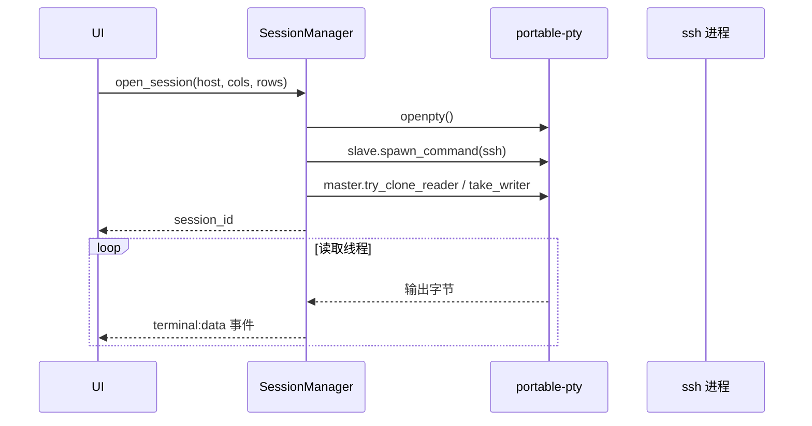

# KeyWisp Agent 实现细节

> 本文档描述当前代码库（M1–M4 + 安全体系）的实际实现方式，与 [技术方案](./技术方案.md) 的规划互相补充。
> 更新日期：2026-08-11

---

## 1. 模块地图

```text
src-tauri/src/         Rust 后端
  lib.rs               应用入口：状态注册、命令注册
  models.rs            数据模型（Host / AiProvider / AiModel / AiRule / AuditLog）
  db.rs                SQLite：建表、读写、数据迁移
  hosts.rs             主机配置 CRUD、ssh config 导入
  credentials.rs       系统钥匙串（密码 / API Key）+ 内存缓存
  session.rs           SSH 交互会话（PTY + 事件流 + 密码自动填充）
  remote.rs            AI 用的远程命令执行器（独立 ssh 进程）
  agent.rs             AI Agent 运行时（自研：流式解析、工具循环、审批、审计）
  ai.rs                AI 平台 / 多模型 / 审核规则配置
  audit.rs             审计日志查询
  sshconfig.rs         ~/.ssh/config 解析

src/                   前端（React + TypeScript + xterm.js）
  App.tsx              布局与状态（主机、会话、AI 配置、日志）
  api.ts               Tauri invoke / 事件监听封装
  components/
    TerminalView.tsx   终端（先监听后连接，杜绝丢首屏）
    ChatPanel.tsx      聊天面板（消息配对、流式、工具审批卡片）
    AIConfigModal.tsx  AI 平台 / 多模型 / 审核规则配置
    AuditLogModal.tsx  操作日志面板
    HostForm.tsx       新建 / 编辑主机（含密码保存）
    Select.tsx         自研下拉框
    Modal.tsx / Toast.tsx / Icons.tsx
```

---

## 2. 数据层

### 2.1 SQLite（db.rs）

`PRAGMA journal_mode = WAL`，5 张表：

| 表 | 用途 | 关键字段 |
| --- | --- | --- |
| `hosts` | 主机配置 | id, name, address, port, username, auth_type, key_path, proxy_jump, notes, created_at |
| `ai_providers` | AI 平台（厂商） | id, name, base_url, protocol, enabled, created_at（保留旧 `model` 列兼容迁移） |
| `ai_models` | 平台下多个模型 | id, provider_id, label, model, is_active, sort |
| `ai_rules` | 智能审核自定义规则 | id, pattern, enabled, created_at |
| `audit_logs` | 审计日志 | 见 §4.5 |

### 2.2 数据迁移

- **hosts.json → SQLite**：首次启动若 `hosts` 表为空且存在旧版 `hosts.json`，逐条导入；
- **单模型 → 多模型**：`ai_providers.model` 有值而 `ai_models` 为空时，为每个平台生成一条激活模型记录，之后统一走 `ai_models` 表。

### 2.3 凭据存储（credentials.rs）

- 使用 `keyring`（macOS Keychain / Windows 凭据管理器 / Linux Secret Service），service 固定为 `com.keywisp.agent`，account 为 `{kind}:{id}`（`password:主机id` / `apikey:平台id`）；
- 数据库只存引用，**明文凭据不落盘**；
- **内存缓存**：每次应用启动后每个条目只真正访问一次钥匙串，之后读内存。原因：未签名的开发版二进制每次编译签名都变，钥匙串 ACL 匹配不上会反复弹授权窗；缓存把弹窗降到“每启动每条目一次”。

---

## 3. SSH 会话层

### 3.1 连接参数（models.rs）

```text
ssh -tt -o "SendEnv -LC_* -LANG" -o ServerAliveInterval=15 -o ServerAliveCountMax=3 \
    -p <port> [-i <key_path>] [-J <proxy_jump>] user@address
```

- `-tt`：强制分配 PTY，支持交互式命令与指纹确认；
- `SendEnv -LC_* -LANG`：不转发本地 locale（避免远端缺少 `C.UTF-8` 时报 setlocale 警告）。注意 OpenSSH 9 的命令行**不接受** `SendEnv=`（会报 `no argument after keyword`），必须用负向排除写法。

### 3.2 会话生命周期（session.rs）



- 每个会话在 `SessionManager` 中持有一个异步读线程，把 PTY 原始字节流通过 `terminal:data` 事件推给前端；
- 读线程 EOF 时发出 `session:status = exited` 并清理会话；`close_session` 会 kill 子进程并发出 `closed`；
- `session_input` 写 PTY、`session_resize` 调整 PTY 尺寸；
- **密码自动填充**：`get_password(host.id)` 取钥匙串密码，读线程扫描最近 4KB 输出，命中 `password:` / `passphrase for key` 时写入 `密码 + \r`（只发一次）；
- **UTF-8 安全截断**：扫描缓冲超过 4KB 时按 `char_boundary` 向前回退再切片，避免切到多字节汉字中间导致 panic（曾因阿里云中文横幅踩坑）。

### 3.3 远程命令执行器（remote.rs）

AI 工具不占用交互会话，而是**每个命令新建一个 ssh 进程**：

- 同样走 portable-pty，超时默认 30s（`recv_timeout` 控制，超时 kill 子进程）；
- 密码自动填充逻辑与会话层相同；
- **快速失败**：检测到认证提示但钥匙串无密码时，立即返回明确错误（“请在主机列表编辑该主机并保存密码”），不挂到超时；
- **输出清理**：正则剥除 ANSI 转义、把 `\r\n` 归一为 `\n`、过滤 `xxx's password:` 之类的认证提示行；
- 长输出在 agent 层截断：保留头 8000 + 尾 4000 字符，附 `[输出过长，已截断]` 标记。

---

## 4. AI Agent 运行时（agent.rs）——自研实现

### 4.0 自研，而不是套用 Agent 框架

核心的 Agent 循环（`run_agent_loop`）是**手写的**，没有引入 LangChain、OpenAI Agents SDK、Vercel AI SDK 等框架。原因：

1. **工具调用循环本身很简单**：一次请求 → 解析出工具调用 → 执行 → 结果回填 → 再来一轮。这个骨架只需要几百行，框架带来的抽象反而是负担；
2. **产品级控制点必须插在循环内部**：审批拦截、审计日志、输出脱敏、按会话隔离历史、模型热切换——这些都需要在“模型返回 → 工具执行”之间做精确拦截，自研可以直接在关键路径上写代码，框架反而要跟它的生命周期钩子博弈；
3. **只依赖 OpenAI 兼容协议**：请求/响应是标准的 `chat/completions + tools`，因此 DeepSeek、通义、Kimi、Ollama、OpenAI 天然通用，不绑定任何厂商 SDK；
4. **可控与可调试**：每个环节（流解析、工具归组、审批等待、错误提取）都是自己的代码，出问题可以直接定位，也方便加日志。

这里的“自研”指**自研 Agent 编排层**，底层仍然调用各家模型的 chat completions 接口，不重复造模型本身的轮子。

### 4.1 设计思想

- **循环即状态机**：一轮 = 请求 → 流式解析 → 判定 → 审批 → 执行 → 回填 → 再请求，直到模型不再调用工具；
- **流式优先**：SSE 增量解析，文本边到边显示，工具调用按 `index` 归组、增量拼接 `arguments`；
- **审批是硬拦截，不是软约束**：工具执行前用 `mpsc` 通道同步等待用户决定，模型无法绕过；拒绝后把“用户拒绝执行”作为工具结果回填，让模型调整方案；
- **可观测**：每个工具调用都落审计日志（命令、审批方式、结果、耗时）；
- **模型无关 + 配置驱动**：模型名每次请求都从激活配置读取，会话内切换立刻生效；
- **容错**：单会话 12 轮上限、审批 10 分钟超时、流尾残留数据处理、非 2xx 响应提取 `error.message`；
- **轻量状态**：历史按 `session_id` 存内存，控制通道按会话注册，不做重量级持久化。

### 4.2 代码案例（真实摘录）

**① 工具循环骨架**（`run_agent_loop`，已精简）

```rust
loop {
    iterations += 1;
    if iterations > 12 { /* 轮次上限，防止失控 */ }
    if let Ok(Control::Cancel) = rx.try_recv() { return Ok(()); }   // 用户点停止

    // 1. 请求：历史 + 工具 schema 发给模型
    let resp = client.post(url).bearer_auth(api_key)
        .json(&json!({ "model": model, "messages": history,
                       "stream": true, "tools": tools_schema() }))
        .send().await?;

    // 2. 解析 SSE，得到文本与工具调用（按 index 归组）
    let (content, tool_calls) = parse_stream(resp).await?;

    if tool_calls.is_empty() {
        history.push(json!({ "role": "assistant", "content": content }));
        app.emit("ai:done", ...);
        return Ok(());                       // 模型直接回答，本轮结束
    }
    history.push(assistant_with_tool_calls(content, &tool_calls));

    // 3. 逐个工具：审批 → 执行 → 回填 → 审计
    for call in tool_calls {
        if need_approval(call, permission_mode, &danger_rules) {
            wait_approval(&rx, &call)?;     // 硬拦截，见案例③
        }
        let output = execute_tool(host, &call.name, &call.args);
        insert_audit(db, session_id, host, &call, ...);  // 每个调用都留痕
        history.push(tool_result(call.id, output));
    }
    // 4. 带着工具结果进入下一轮，让模型总结
}
```

**② SSE 增量解析**（`apply_delta`，真实代码节选）

```rust
fn apply_delta(delta: &Value, content: &mut String,
               tool_calls: &mut HashMap<usize, ToolCallAcc>, ...) {
    if let Some(t) = delta["content"].as_str() {
        content.push_str(t);                      // 文本增量 → 前端流式展示
        app.emit("ai:stream", AiStream { session_id, delta: t.to_string() });
    }
    if let Some(calls) = delta["tool_calls"].as_array() {
        for call in calls {
            let index = call["index"].as_u64().unwrap_or(0) as usize;
            let acc = tool_calls.entry(index).or_default();
            if let Some(id) = call["id"].as_str()      { acc.id = id.into(); }
            if let Some(name) = call["function"]["name"].as_str() { acc.name = name.into(); }
            if let Some(args) = call["function"]["arguments"].as_str() {
                acc.args.push_str(args);              // arguments 是增量 JSON 片段
            }
        }
    }
}
```

**③ 审批等待（硬拦截）**（真实代码节选）

```rust
let decision = loop {
    match rx.recv_timeout(Duration::from_secs(600)) {
        Err(_) => return Err("等待审批超时".into()),
        Ok(Control::Cancel) => return Ok(()),   // 用户中断
        Ok(Control::Approve { tool_call_id, allow })
            if tool_call_id == acc.id => break allow,
        Ok(Control::Approve { .. }) => continue, // 丢弃过期审批
    }
};
```

前端按钮 → `agent_approve(session_id, tool_call_id, allow)` → 通道投递；后端收到匹配的 `tool_call_id` 才放行，避免多工具调用时审批错位。

**④ 智能审核判定**（真实代码节选）

```rust
let need_approval = match permission_mode {
    "all"  => true,                              // 全部审核
    "none" => false,                             // 全部放行
    _ => {                                       // 智能审核
        if acc.name != "exec_command" { false }  // 只读工具自动执行
        else {
            let marked = args["requires_approval"].as_bool().unwrap_or(false);
            let c = command.to_ascii_lowercase();
            marked                                       // 模型自判危险
                || is_dangerous(command)                 // 内置危险模式
                || danger_rules.iter().any(|p| c.contains(&p.to_ascii_lowercase()))
        }                                              // 用户自定义规则（子串匹配）
    }
};
```

**⑤ 审计写入**（`insert_audit`，调用方式）

```rust
match execute_tool(host, &acc.name, &args) {
    Ok(output) => {
        insert_audit(db, session_id, host, &acc, &args,
                     permission_mode, approval_label, "executed",
                     Some(output.clone()), elapsed_ms);
        history.push(json!({ "role": "tool", "tool_call_id": acc.id, "content": output }));
    }
    Err(err) => { /* 同样写审计，状态为 error */ }
}
```

**⑥ 身份提示词注入**（`system_prompt`，节选）

```rust
format!(
    "你是 KeyWisp Agent……\n\
     当前由 {} 平台提供能力，当前配置的底层模型是 {}。\n\
     ……\n\
     5. 身份说明：当用户询问“你是什么模型/你由谁开发”时，如实回答你由 {} 驱动、
        配置的模型为 {}；不要声称自己是任何其他 AI 助手（如 ChatGPT、Claude、Gemini 等），
        也不要编造版本号或开发厂商信息。",
    provider.name, model, provider.name, model
)
```

### 4.3 请求流程

1. `agent_chat(session_id, message, permission_mode)`：
   - 校验安全级别为 `all` / `smart` / `none`；
   - 取该会话的主机、启用的 AI 平台、**激活模型**（`ai_models.is_active`，无激活则取第一个）、钥匙串里的 API Key；
   - 取自定义审核规则；按会话恢复/新建历史（首轮注入系统提示词，见 §4.6）；
2. 循环调用 OpenAI 兼容接口（`POST {base_url}/chat/completions`，`stream: true`）：
   - 解析 SSE `data:` 行，累积 `content` 与按 index 归组的 `tool_calls`（id / name / arguments 增量拼接）；
   - 处理流结束时缓冲区残留的未换行数据，避免最后一段内容丢失；
   - 若没有工具调用：把最终文本写入历史，发 `ai:done`，结束；
   - 若有工具调用：发 `ai:tool(request)` → 审批 → 执行 → 发结果 → 写入历史 → 进入下一轮；
3. 单会话最多 **12 轮**工具调用，超限报错停止。

### 4.4 审批与安全级别

`permission_mode` 三种取值，作用于每个工具调用：

| 级别 | 行为 |
| --- | --- |
| `all`（全部审核） | 每个工具调用都等待用户批准 |
| `none`（全部放行） | 直接执行，不弹审批 |
| `smart`（智能审核） | 只读工具（read_file / list_dir / resource_usage）自动执行；`exec_command` 满足以下任一条件则需审批 |

智能审核判定（三者 OR）：

1. 模型在工具参数里标记 `requires_approval: true`；
2. 命令命中内置危险模式（`rm -rf`、`mkfs`、`iptables`、`systemctl stop/restart/disable/mask`、`shutdown`、`reboot`、`chmod -R`、`dd if=`、`drop database` 等）；
3. 命令包含任意自定义规则（**不区分大小写的子串匹配**，无需通配符）。

审批通过 `mpsc` 通道交互：`agent_chat` 等待 `recv_timeout(600s)`，前端按钮调用 `agent_approve(session_id, tool_call_id, allow)` 发送决定；拒绝后把“用户拒绝执行该操作”作为工具结果回填给模型，让 AI 调整方案。

### 4.5 工具集

| 工具 | 参数 | 说明 |
| --- | --- | --- |
| `exec_command` | command, timeout_secs, requires_approval | 执行 shell 命令 |
| `read_file` | path | `cat` 读文件 |
| `list_dir` | path | `ls -lah` 列目录 |
| `resource_usage` | — | df / free / uptime / TOP 进程汇总 |

命令经单引号安全转义（`'` → `'\''`）后交给 ssh 执行。

### 4.6 审计日志（agent.rs + audit.rs）

每个工具调用结束时写一条 `audit_logs`：

- 时间戳、会话 ID、主机 id / 标签、工具名、命令摘要（截断 500 字符）；
- 安全级别、审批方式（`auto` / `approved` / `denied`）、执行状态（`executed` / `denied` / `error`）；
- 结果摘要（截断 300 字符）、耗时（ms）。

前端「操作日志」面板通过 `list_audit_logs` 拉取最近 100 条。

### 4.7 上下文与身份

- 会话历史保存在 `AgentManager` 内存中，按 `session_id` 隔离；`agent_reset`（清空对话按钮）可清除；
- 系统提示词**注入真实平台与模型**（如“当前由 DeepSeek 提供能力，模型为 deepseek-v4-pro”），并明确要求被问身份时如实回答、不得冒认 ChatGPT / Claude / Gemini 等——用于规避模型身份幻觉；
- 工具结果只回填截断后的摘要，控制 token 预算。

---

## 5. AI 配置（ai.rs）

- 平台 CRUD：name / base_url / protocol（默认 `openai-compatible`）/ enabled / API Key；
- **多模型**：每个平台持有 `ai_models` 列表，保存时全量替换；`set_active_ai_model` 把目标模型置为唯一激活项（先全部置 0 再置 1）；
- **测试连接**：非流式请求 `{base_url}/chat/completions`（`max_tokens: 1`），返回成功或带错误详情的提示（401 / 429 等）；
- 预置平台：DeepSeek、OpenAI、通义千问、Kimi、Ollama，各带两个默认模型，用户可自由增删改。

---

## 6. 前端实现

### 6.1 终端：先监听后连接（TerminalView.tsx）

早期实现是先 `open_session` 再异步注册事件监听，服务器初始输出（横幅 / 提示符）会在监听就绪前丢失，表现为“断开后重连首屏空白”。现在流程固定为：

1. 挂载 xterm.js 并 fit；
2. `await` 注册 `terminal:data` 与 `session:status` 监听；
3. 再调用 `open_session`；
4. 连接成功后回调 `onOpened(sessionId)`，App 才渲染聊天面板。

卸载时自动 `close_session`，避免会话泄漏。

### 6.2 聊天消息配对（ChatPanel.tsx）

- 每次发送创建两条消息：用户消息 + **专属 AI 占位消息**，并把占位消息 ID 记入 `activeAssistantId`；
- 流式内容、工具卡片、错误提示都只更新该 ID，杜绝“回答续写进上一轮气泡”的顺序错乱；
- 空占位在收到内容前不渲染，避免空白气泡；
- 底部控制条：安全级别（默认 `smart`，localStorage 持久化）+ 模型切换；AI 回复经 `react-markdown + remark-gfm` 渲染（代码块 / 表格 / 列表）。

### 6.3 自研下拉框（Select.tsx）

- 按钮 + 绝对定位菜单，箭头旋转动画、选项选中打勾；
- 键盘支持 `↑`/`↓`/`Enter`/`Esc`，点击外部关闭；
- `select-up` 类使聊天底部的下拉向上弹出，避免被窗口底部截断；
- 安全级别档位配色：智能=紫 + “推荐”徽章、全部审核=蓝、全部放行=琥珀。

---

## 7. 前后端接口

### 7.1 Tauri Commands

| 模块 | 命令 |
| --- | --- |
| 主机 | `list_hosts` `create_host` `update_host` `delete_host` `import_ssh_config` `save_host_credentials` |
| 会话 | `open_session` `close_session` `session_input` `session_resize` |
| AI 配置 | `list_ai_providers` `save_ai_provider` `delete_ai_provider` `set_active_ai_model` `test_ai_provider` |
| 审核规则 | `list_ai_rules` `add_ai_rule` `delete_ai_rule` |
| Agent | `agent_chat` `agent_approve` `agent_cancel` `agent_reset` |
| 审计 | `list_audit_logs` |

**注意**：Tauri 2 会把 Rust 参数名转成 camelCase 传给前端，例如 `base_url → baseUrl`、`api_key → apiKey`、`permission_mode → permissionMode`、`tool_call_id → toolCallId`。

### 7.2 后端事件（前端 listen）

| 事件 | 载荷 | 触发时机 |
| --- | --- | --- |
| `terminal:data` | session_id, data(bytes) | 终端输出 |
| `session:status` | session_id, status | exited / closed |
| `ai:stream` | session_id, delta | 模型流式文本 |
| `ai:tool` | session_id, tool_call_id, name, args, state, output | request / running / result / error / denied |
| `ai:done` | session_id | 一轮回复完成 |
| `ai:error` | session_id, message | 请求或执行错误 |

---

## 8. 踩坑记录

| 问题 | 根因 | 解法 |
| --- | --- | --- |
| setlocale 警告 | macOS 默认转发 `LC_ALL=C.UTF-8`，远端无此 locale | `-o "SendEnv -LC_* -LANG"`（负向排除，`SendEnv=` 在 OpenSSH 9 CLI 非法） |
| 终端断流 | 输出扫描缓冲按字节切片切到多字节字符，panic 杀死读线程 | 按 `char_boundary` 回退切片 |
| 钥匙串反复弹窗 | 开发版二进制每次编译签名变化，ACL 不匹配 | 凭据内存缓存，每启动每条目只读一次 |
| 重连首屏空白 | 先连接后监听，初始输出被丢 | 先注册监听再 `open_session` |
| 消息顺序错乱 | 流式更新定位“最后一条 assistant”，误写上一轮 | 每条用户消息配对专属 AI 消息 ID |
| 模型自称 Claude | 系统提示词未注入真实平台/模型，身份由模型自述 | 注入平台名 + 模型名 + 禁止冒认规则 |
| 总结文字丢失 | SSE 流末尾无换行的数据残留在缓冲区未处理 | 流结束后补处理残留缓冲区 |

---

## 9. 安全边界与限制

- 凭据、私钥、API Key 不进入模型上下文，认证由后端注入；
- 审计日志记录所有 AI 工具调用，便于追溯；
- 工具输出截断（12KB）、单会话 12 轮上限、审批 10 分钟超时；
- 当前 SSH 走系统 OpenSSH，AI 工具每次新建连接（每次都要认证一次）；切换到 russh 后可复用连接并获得结构化 channel（规划中）；
- 开发模式存在钥匙串授权弹窗（未签名），正式发布需 macOS 公证 / Windows 代码签名。
