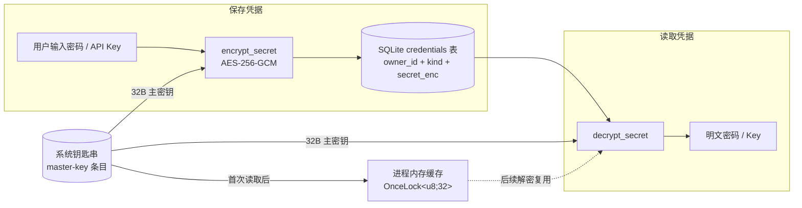
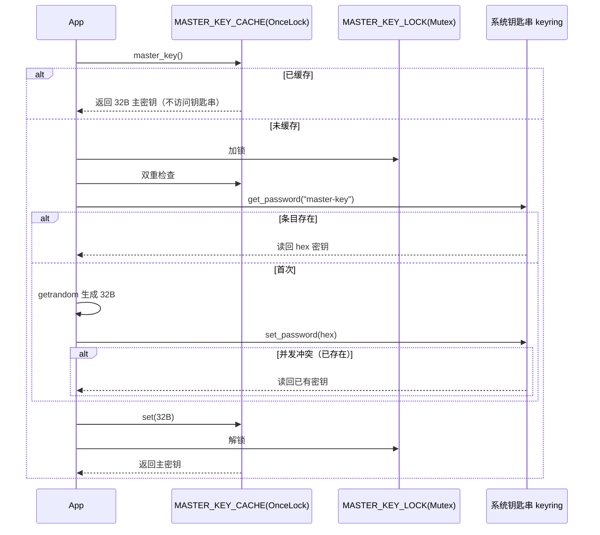

# 密码存储加密设计

> buffTerm 的凭据（SSH 主机密码、AI 平台 API Key）采用 **AES-256-GCM 加密后落 SQLite**：数据库文件不包含明文，主密钥存系统钥匙串并在进程内存缓存，整个进程会话只访问一次钥匙串。

## 1. 总体设计



- **凭据**：主机密码 `kind=password`、AI API Key `kind=apikey`，全部用同一把主密钥加密；
- **主密钥**：随机 32 字节，存放于系统钥匙串（keyring）单条目 `master-key`；
- **内存缓存**：主密钥首次从钥匙串读取 / 生成后常驻内存，连接任意主机、调用任意 AI 都不再访问钥匙串。

## 2. 密文数据格式

AES-256-GCM 使用 12 字节随机 nonce，输出 = nonce + 密文 + 16 字节认证 tag，最终 base64 编码后入库：

```mermaid
block-beta
  columns 4
  block:nonce["nonce (12B)<br/>每次随机"]:1
  block:ct["ciphertext<br/>(明文同长)"]:2
  block:tag["GCM tag (16B)<br/>完整性校验"]:1
  style nonce fill:#dbeafe
  style ct fill:#dcfce7
  style tag fill:#fef9c3
```

`credentials` 表 DDL：

```sql
CREATE TABLE IF NOT EXISTS credentials (
    owner_id   TEXT NOT NULL,   -- 主机 id 或 AI 平台 id
    kind       TEXT NOT NULL,   -- 'password' | 'apikey'
    secret_enc TEXT NOT NULL,   -- base64(nonce || ciphertext || tag)
    updated_at INTEGER NOT NULL,
    PRIMARY KEY (owner_id, kind)
);
```

## 3. 主密钥生命周期



关键代码（`credentials.rs`）：

```rust
static MASTER_KEY_CACHE: OnceLock<[u8; 32]> = OnceLock::new();
static MASTER_KEY_LOCK: Mutex<()> = Mutex::new(());

fn master_key() -> Result<[u8; 32], String> {
    if let Some(key) = MASTER_KEY_CACHE.get() { return Ok(*key); }
    let _guard = MASTER_KEY_LOCK.lock().unwrap();
    if let Some(key) = MASTER_KEY_CACHE.get() { return Ok(*key); }
    let key = load_or_create_master_key()?;
    let _ = MASTER_KEY_CACHE.set(key);
    Ok(key)
}
```

## 4. 加密 / 解密

```rust
fn encrypt_secret(plain: &str) -> Result<String, String> {
    let key = master_key()?;
    let cipher = Aes256Gcm::new(Key::<Aes256Gcm>::from_slice(&key));
    let mut nonce_bytes = [0u8; 12];
    getrandom::getrandom(&mut nonce_bytes).map_err(|e| format!("生成随机 nonce 失败: {e}"))?;
    let ct = cipher
        .encrypt(Nonce::from_slice(&nonce_bytes), plain.as_bytes())
        .map_err(|e| format!("加密失败: {e}"))?;
    let mut blob = Vec::with_capacity(12 + ct.len());
    blob.extend_from_slice(&nonce_bytes);
    blob.extend_from_slice(&ct);
    Ok(B64.encode(blob))
}

fn decrypt_secret(enc: &str) -> Result<String, String> {
    let key = master_key()?;
    let cipher = Aes256Gcm::new(Key::<Aes256Gcm>::from_slice(&key));
    let blob = B64.decode(enc).map_err(|e| format!("凭据密文解码失败: {e}"))?;
    if blob.len() < 12 + 16 { return Err("凭据密文长度异常".into()); }
    let (nonce, ct) = blob.split_at(12);
    let plain = cipher
        .decrypt(Nonce::from_slice(nonce), ct)
        .map_err(|_| "凭据解密失败（主密钥不匹配？）".to_string())?;
    String::from_utf8(plain).map_err(|_| "凭据解密结果非法".to_string())
}
```

- GCM 的认证 tag 保证密文完整性：密文被篡改或主密钥不匹配时 `decrypt` 直接失败，不会返回错误明文；
- 每次加密使用随机 nonce，同一明文两次加密结果不同。

## 5. 凭据读写（SQLite + 明文缓存）

```rust
pub fn save_password(host_id: &str, password: &str) -> Result<(), String> {
    let db = db().ok_or_else(|| "数据库未就绪".to_string())?;
    if password.is_empty() {
        cache_remove("password", host_id);
        db.delete_credential(host_id, "password")?;
        return Ok(());
    }
    let enc = encrypt_secret(password)?;
    db.set_credential(host_id, "password", &enc)?;
    cache_set("password", host_id, password.to_string());  // 明文仅进内存
    Ok(())
}

pub fn get_password(host_id: &str) -> Option<String> {
    if let Some(cached) = cache_get("password", host_id) { return Some(cached); }
    let db = db()?;
    let enc = db.get_credential(host_id, "password").ok()??;
    let plain = decrypt_secret(&enc).ok()?;
    cache_set("password", host_id, plain.clone());
    Some(plain)
}
```

- 数据库只存密文，明文只在**内存缓存**中出现；
- 连接主机、调用 AI 都走同一路径（`get_password` / `get_api_key`），先查内存缓存，未命中才解密。

## 6. 安全边界

- 数据库文件被拷贝到其他机器**无法解密**（解密依赖本机钥匙串中的主密钥）；
- 清除钥匙串 / 重装系统后密文不可恢复，需重新保存凭据；
- 主密钥每次进程启动首次解密时从钥匙串读取一次（未签名开发版可能弹一次系统授权），随后全程走内存缓存；
- 一把主密钥加密所有凭据：泄露主密钥即泄露全部凭据，因此主密钥严格保存在系统钥匙串，不落数据库。
