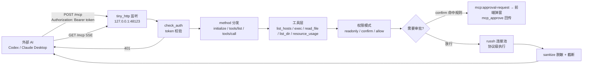
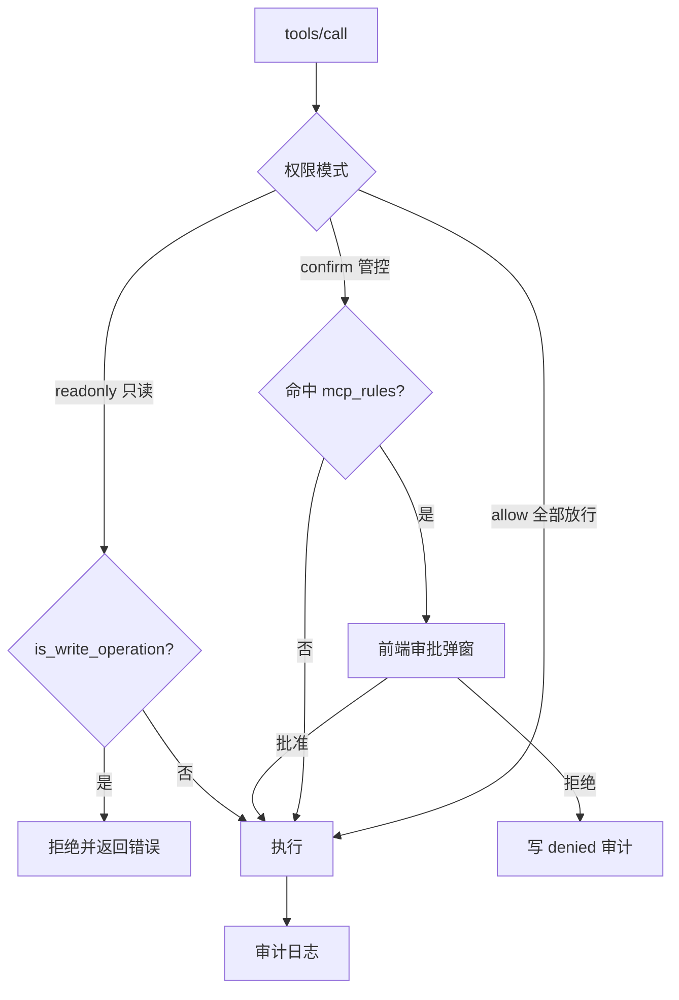

# 对外 MCP 服务设计

> buffTerm 作为 MCP 服务器（自研 Streamable HTTP + JSON-RPC + token 认证），把用户勾选的服务器能力开放给外部 AI（Codex、Claude Desktop 等）。协议层基于 tiny_http 手写实现，无框架依赖。

## 1. 架构



- 服务**按需启动**：用户勾选主机并点「启动服务」才监听 `127.0.0.1`（默认端口 48123，被占用则随机），应用启动且配置 `enabled` 时自动恢复监听；
- 启动时生成随机 token（64 位 hex），支持吊销重生成（`rotate_mcp_token`）；关闭通过 oneshot 通知监听线程退出。

## 2. 鉴权

```rust
fn check_auth(app: &AppHandle, request: &Request) -> bool {
    let db = match app.try_state::<Arc<Db>>() {
        Some(db) => db,
        None => return false,
    };
    let token = db.get_mcp_service().ok().and_then(|c| c.token).unwrap_or_default();
    if token.is_empty() { return false; }
    if let Some(h) = request.headers().iter().find(|h| h.field.equiv("Authorization")) {
        let v = h.value.as_str();
        if v == token { return true; }                       // 裸 token
        if let Some(b) = v.strip_prefix("Bearer ") { if b == token { return true; } }
        if let Some(b) = v.strip_prefix("bearer ") { if b == token { return true; } }
    }
    // 也支持 ?access_token= 查询参数
    false
}
```

## 3. 协议与请求分发

- `POST /mcp`：JSON-RPC 2.0，支持 `initialize`（协议版本 `2025-03-26`、`serverInfo.name = buffterm-ssh`）、`notifications/initialized`、`ping`、`tools/list`、`tools/call`；
- `GET /mcp`：SSE 事件流（心跳保活）。tiny_http 的 `respond` 会先把响应写入 BufWriter，无限流 body 阻塞读取时 header 无法 flush，因此 SSE 用 `request.into_writer()` 手动写响应头并立即 flush；
- 工具调用同步返回 `{ content: [{ type: "text", text }], isError }`；错误以 `isError: true` 返回，避免中断外部 AI 会话。

```mermaid
flowchart TD
  R[请求] --> M{method?}
  M -->|initialize| I[serverInfo + 协议能力]
  M -->|ping| P[{}]
  M -->|tools/list| L[返回 tools_schema]
  M -->|tools/call| C[call_tool 分发]
  M -->|其他| E[json_error -32601]
  C --> OK[{"content:[text], isError:false"}]
  C --> ERR[{"content:[错误], isError:true"}]
```

```rust
"tools/call" => {
    let name = value["params"]["name"].as_str().unwrap_or("").to_string();
    let args = value["params"]["arguments"].clone();
    let args = if args.is_object() { args } else { serde_json::json!({}) };
    match call_tool(app, &name, &args).await {
        Ok(text) => respond(id, serde_json::json!({
            "content": [{ "type": "text", "text": text }], "isError": false })),
        Err(e) => respond(id, serde_json::json!({
            "content": [{ "type": "text", "text": format!("错误: {e}") }], "isError": true })),
    }
}
```

## 4. 工具集（host 参数化）

| 工具 | 参数 | 说明 |
| --- | --- | --- |
| `list_hosts` | — | 仅返回服务启用时勾选的主机 |
| `resource_usage` | host | 磁盘 / 内存 / 负载 / TOP 进程 |
| `read_file` | host, path | 读文件 |
| `list_dir` | host, path? | 列目录 |
| `exec_command` | host, command, timeout_secs? | 执行命令（受权限模式约束） |

- `host` 支持 id / name / address 三种匹配，未勾选的主机直接拒绝（“未授权给 MCP 服务”）；
- 外部 AI 不依赖“当前已连接主机”，每次调用按需通过 russh 连接池执行；
- 输出复用 `safety::sanitize` 脱敏 + `util::format_exec_output` 截断，外部调用同样写审计日志（`permission_mode = mcp`）。

## 5. 权限模式



只读模式写操作检测（`is_write_operation`）三层：

1. 命中内置危险命令表（rm / mkfs / 关机等）→ 视为写操作；
2. 重定向写文件：清理掉 `2>/dev/null`、`2>&1` 等无害写法后仍含 `>` / `>>` → 拒绝；
3. 写类命令关键词：touch / mv / cp / chmod / chown / sed -i / apt / yum / pip install / curl -o / scp / tar -x / git push / docker 等 → 拒绝。

管控模式审批桥接（真实代码）：

```rust
// mcp.rs：危险命令命中 → 注册 oneshot → 发前端事件 → 等待决定
let registry = app.state::<ApprovalRegistry>();
let rx = registry.register(request_id.clone());
app.emit("mcp:approval-request", json!({ "request_id", "host", "command", ... }));
let approved = tokio::time::timeout(Duration::from_secs(600), rx).await?;
```

前端 `McpApprovalModal` 展示主机与命令，用户点「批准 / 拒绝」后调用 `mcp_approve(request_id, allow)`，后端通过 oneshot 放行或终止；拒绝时写 `denied` 审计日志。

## 6. 接入配置

开启后弹窗自动生成并复制：

```json
{
  "mcpServers": {
    "buffterm-ssh": {
      "type": "http",
      "url": "http://127.0.0.1:48123/mcp",
      "headers": { "Authorization": "Bearer <token>" }
    }
  }
}
```
