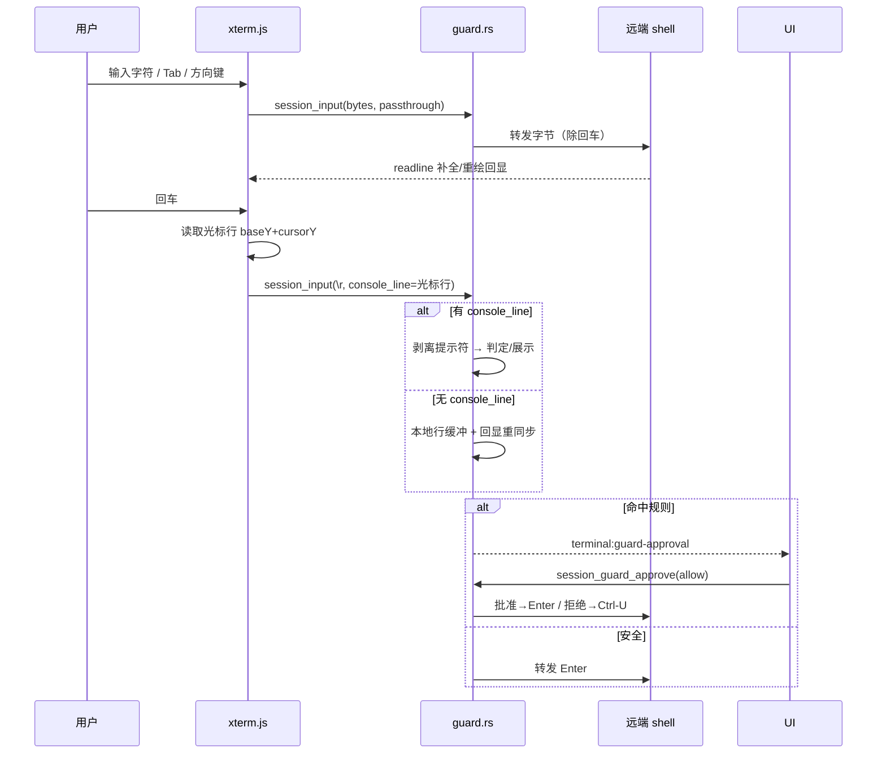
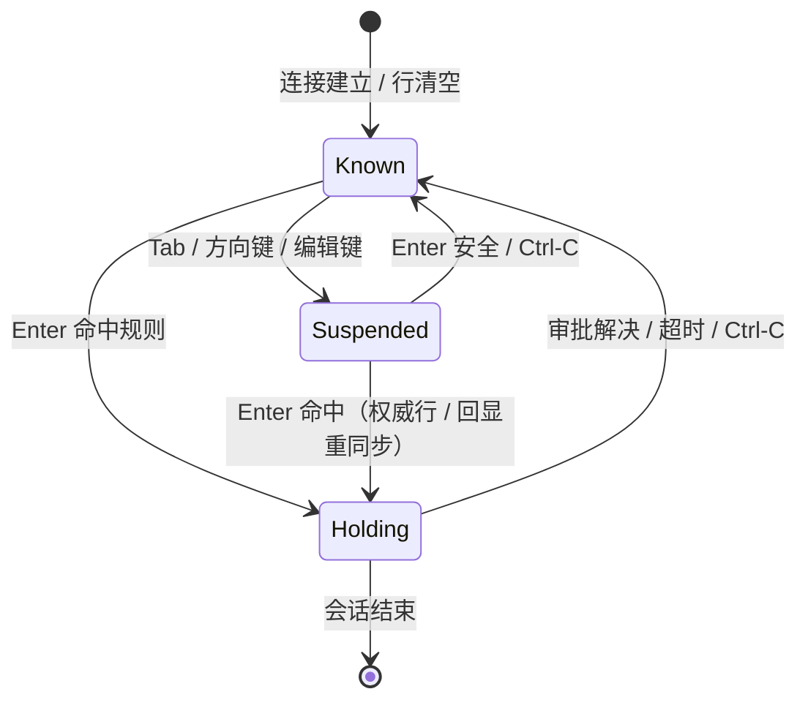

# 终端危险命令拦截设计（最终实现）

> 目标：用户在**交互终端**（xterm.js + russh shell channel）直接输入高危命令（如 `rm -rf /`）时，应用在**回车前**拦截判定，命中规则则弹窗确认后才真正执行。
>
> 定位：**防误操作**级别，不是安全边界——所有拦截都在应用层，换任意 SSH 客户端即可绕过。设计目标是把“手滑敲了 `rm -rf /`”这类事故拦住。

## 1. 核心思路：前端权威命令行

交互终端里，行编辑（补全、历史、光标移动）由**远端 readline** 完成，远端 shell 会通过回显把**最终行**完整渲染到终端。前端 xterm 缓冲区里就是 readline 最终行的可信镜像。

因此采用**“前端权威命令行 + 后端判定”**：

```
用户敲击 → TerminalView.onData
   ├─ 普通字符 → session_input(session_id, bytes)
   └─ 回车 → 读取 xterm 当前光标行（baseY + cursorY）
              → session_input(session_id, bytes, console_line=光标行)
                      │
                      ▼
        session.rs Guard 引擎
          ├─ 有 console_line → 剥离提示符，以该命令判定 + 弹窗展示
          └─ 无 console_line → 本地行缓冲 + 回显重同步兜底
                      │
         ┌────────────┴────────────┐
         │ 安全：转发 Enter         │
         │ 命中：扣住 Enter → Holding│
         └────────────┬────────────┘
                      ▼
        emit "terminal:guard-approval"
                      ▼
         GuardApprovalModal 弹窗（命令 + 命中规则）
              ┌───────┴───────┐
              │ 批准 → 放行 Enter │
              │ 取消 → 发 Ctrl-U  │
              └───────┬───────┘
                      ▼
          关闭弹窗后前端自动聚焦终端
```

- 命令文本在拦截发生时**已完整存在于远端 shell 输入缓冲**（应用只是扣住 Enter）；批准 = 放行 Enter，取消 = 发 Ctrl-U 清行，**不需要重发命令**。
- 前端读取的光标行含提示符（如 `root@host:~# cat docker-compose.yml`），后端剥离首个提示符标记（`#` / `$` / `%` / `>`）之后的内容作为命令。
- 光标行读取用 `baseY + cursorY`（xterm 的 `cursorY` 是视口相对坐标，终端滚动后必须加 `baseY`），避免命令执行输出多行后读到文件内容行。



## 2. 判定策略（三层）

| 层 | 数据源 | 作用 |
| --- | --- | --- |
| ① 权威命令行 | 前端 xterm 光标行（`console_line`） | 主路径：Tab 补全 / 方向键历史 / 编辑键后，判定与弹窗展示都以它为准 |
| ② 本地行缓冲 | 应用转发的按键字节（退格 / Ctrl-U / Ctrl-C / Ctrl-W 维护） | 前端拿不到光标行（粘贴多行等）时兜底 |
| ③ 回显重同步 | 远端 readline 重绘（`\r + 提示符 + 完整行`） | Suspended 态 Enter 时，从同步缓冲提取最后一行参与判定 |

## 3. 状态机（后端 guard.rs）

| 状态 | 含义 |
| --- | --- |
| `Known` | 当前行内容可信（本地缓冲重建） |
| `Suspended` | 行内容不可信（Tab / 方向键 / 编辑键后），等待权威命令行或回显重同步 |
| `Holding` | 命中规则，Enter 被扣住，等待审批 |



关键机制：

- **回显等待窗口**：Suspended 态收到回车时延迟 ~200ms 再判定，覆盖常见网络往返，让 readline 补全 / 重绘回显先到达；
- **第二次 Tab（`tab_again`）**：Suspended 后再次 Tab，readline 可能已把之前的输入替换（如 `confcon → conf`），标记旧输入失效，弹窗重建时不再拼接，避免出现 `cat logtail.confcon` 这类错误命令；
- **透传（passthrough）**：vim / htop / less 等 alternate screen 期间前端随每次 `session_input` 传 `passthrough=true`（与按键同路同步），后端幂等切换，全屏应用内文本不误判；
- **续行**：以 `\` 结尾的行不判定，内容累积到下一行合并（拦截 `rm \` + `-rf /` 跨行拼装）；
- **审批聚焦**：弹窗关闭后前端通过全局事件让可见的激活终端重新获得键盘焦点。

## 4. 规则与配置

`terminal_rules` 表（预置 + 自定义，子串匹配、大小写不敏感），预置清单覆盖：删除（`rm -rf` 等）、磁盘/分区（`mkfs` / `fdisk` / `dd if=` 等）、关机重启、服务管理（`systemctl stop` 等）、防火墙、账户权限、数据库（`drop table` 等）、强杀进程、文件属性（`chattr`）、Git 强推/硬重置、危险管道（`curl | sh`）、覆盖系统文件（`> /etc/`）。

设置存 `settings` 表：总开关、审批超时（默认 60s，可配置）。预置规则首次建库写入（settings 标记防重复），侧边栏「终端防护」入口可删改规则、恢复预置。

## 5. 前后端接口

- Commands：`get_terminal_guard_settings` / `save_terminal_guard_settings` / `list_terminal_rules` / `add_terminal_rule` / `delete_terminal_rule` / `reset_terminal_rules` / `session_guard_approve`；`session_input` 增加 `console_line`（前端光标行）与 `passthrough` 参数。
- 事件：`terminal:guard-approval`，载荷 `{ session_id, request_id, host_label, command, matched_patterns }`。
- 审计：命中并审批的命令写入 `audit_logs`（`tool_name=terminal_command`，approval = approved / denied / timeout），命令先 `sanitize` 脱敏。

## 6. 关键代码

### 6.1 前端读取光标行（TerminalView.tsx）

```ts
const readConsoleLine = useCallback((): string | null => {
  const term = termRef.current;
  if (!term) return null;
  const buf = term.buffer.active;
  // cursorY 是视口相对坐标，getLine 需要绝对行号；终端滚动后必须加 baseY
  const line = buf.getLine(buf.baseY + buf.cursorY);
  if (!line) return null;
  const text = line.translateToString(true).trimEnd();
  return text || null;
}, []);

// 回车时随输入一起传给后端
term.onData((data) => {
  const bytes = Array.from(new TextEncoder().encode(data));
  if (bytes.length === 1 && bytes[0] >= 0x20 && bytes[0] <= 0x7e) return;
  let consoleLine: string | null = null;
  if (bytes.length === 1 && (bytes[0] === 0x0d || bytes[0] === 0x0a)) {
    consoleLine = readConsoleLine();   // 单次回车才读取
  }
  sendInput(bytes, consoleLine);
});
```

### 6.2 后端权威命令行优先（guard.rs）

```rust
fn handle_enter_suspended(&mut self, out: &mut GuardOutcome, console_line: Option<&str>) {
    // 前端提供了当前控制台行（权威，含 readline 补全/历史/编辑后的最终命令）
    if let Some(cmd) = console_line
        .map(extract_command_from_console_line)
        .map(|s| s.trim().to_string())
        .filter(|s| !s.is_empty())
    {
        let display = cmd.clone();
        self.sync_buf.clear();
        let lower = display.to_ascii_lowercase();
        let matched = /* 预置 + 自定义规则子串匹配 */;
        if !matched.is_empty() {
            self.state = GuardState::Holding;
            out.approval = Some(ApprovalRequest {
                command: display,
                matched_patterns: matched,
                /* ... */
            });
        } else {
            out.forward.push(b'\r');  // 安全，放行
            /* 清空缓冲 */
        }
        return;
    }
    // 无权威行 → 本地行缓冲 + 回显重同步兜底
    /* ... */
}

/// 剥离提示符：取首个 `#` / `$` / `%` / `>` 之后的命令部分
fn extract_command_from_console_line(line: &str) -> String {
    let t = line.trim();
    if let Some(pos) = t.find(['#', '$', '%', '>']) {
        let rest = t[pos + 1..].trim_start();
        if !rest.is_empty() { return rest.to_string(); }
    }
    t.to_string()
}
```

## 7. 安全边界与盲区

- 防误操作级别：vim 内 `:!` 命令、raw mode 应用（readline 不参与行编辑）无法覆盖；换任意 SSH 客户端即可绕过；
- 前端命令行与后端判定**都**来自用户输入，拦截的是“用户自己的命令”，不构成对抗恶意软件的边界；
- 判定依据是“终端里最终显示的命令行”，与远端实际执行一致；本地缓冲与回显重建仅作兜底。

## 8. 测试

单元测试（guard.rs）覆盖：行重建（字符 / 退格 / Ctrl-U / Ctrl-C / Ctrl-W / UTF-8 / 粘贴分段）、规则命中与放行、续行合并、Suspended 兜底、Tab 补全（含 BEL 响铃、回显延迟、第二次 Tab 替换、候选列表不混入弹窗）、方向键历史回放、审批（批准放行 / 拒绝清行 / 超时）、透传幂等、凭据加密往返。

手动验证：直接敲高危命令弹窗 → 取消/批准行为正确；`sudo rm -rf /` 命中；Tab 补全后弹窗显示补全后的完整命令；方向键历史回放命中；vim 内不误判；多标签并发审批按 session_id 归属；审批后无需点击即可继续输入。
