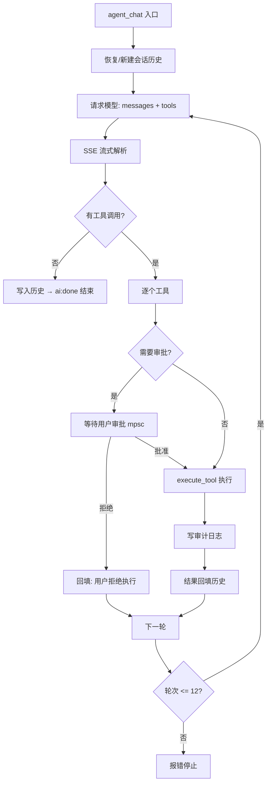
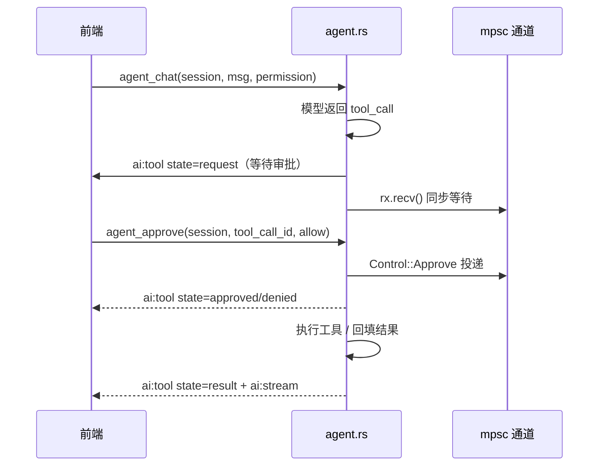
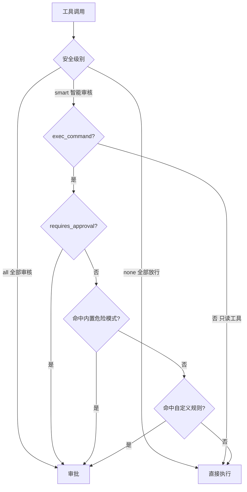

# 自研 AI Agent 与权限设计

> buffTerm 内置的 AI Agent 编排层为**手写实现**（不依赖 LangChain / OpenAI Agents SDK / Vercel AI SDK 等框架）：SSE 流式解析 → 工具调用循环 → 审批拦截 → 审计留痕全部自研。本文档描述 Agent 运行时、审批与安全级别、工具集、审计与 AI 平台配置。

## 4. AI Agent 运行时（agent.rs）——自研实现

### 4.0 自研，而不是套用 Agent 框架

核心的 Agent 循环（`run_agent_loop`）是**手写的**，没有引入 LangChain、OpenAI Agents SDK、Vercel AI SDK 等框架。原因：

1. **工具调用循环本身很简单**：一次请求 → 解析出工具调用 → 执行 → 结果回填 → 再来一轮，骨架只需几百行；
2. **产品级控制点必须插在循环内部**：审批拦截、审计日志、输出脱敏、按主机隔离历史、模型热切换——这些都需要在“模型返回 → 工具执行”之间精确拦截，自研可以直接在关键路径上写代码；
3. **只依赖 OpenAI 兼容协议**：标准 `chat/completions + tools`，因此 DeepSeek、通义、Kimi、Ollama、OpenAI 天然通用；
4. **可控与可调试**：流解析、工具归组、审批等待、错误提取都是自己的代码，出问题可直接定位。

这里的“自研”指**自研 Agent 编排层**，底层仍调用各家模型的 chat completions 接口。

### 4.1 设计思想

- **循环即状态机**：一轮 = 请求 → 流式解析 → 判定 → 审批 → 执行 → 回填 → 再请求，直到模型不再调用工具；
- **流式优先**：SSE 增量解析，文本边到边显示，工具调用按 `index` 归组、增量拼接 `arguments`；
- **审批是硬拦截，不是软约束**：工具执行前用 `mpsc` 通道同步等待用户决定，模型无法绕过；拒绝后把“用户拒绝执行”作为工具结果回填，让模型调整方案；
- **可观测**：每个工具调用都落审计日志（命令、审批方式、结果、耗时）；
- **模型无关 + 配置驱动**：模型名每次请求都从激活配置读取，会话内切换立刻生效；
- **容错**：单会话 12 轮上限、审批 10 分钟超时、流尾残留数据处理、非 2xx 响应提取 `error.message`；
- **工具名契约**：系统提示词明确工具名白名单；解析层对模型漏填名称做参数推断（`command` → `exec_command`、`path` → `read_file`），并对常见别名归一化（`ls/listdir/list_directory` → `list_dir` 等），降低模型幻觉导致的调用失败。



### 4.2 代码案例（真实摘录）

**① 工具循环骨架**（`run_agent_loop`，已精简）

```rust
loop {
    iterations += 1;
    if iterations > 12 { /* 轮次上限，防止失控 */ }
    if let Ok(Control::Cancel) = rx.try_recv() { return Ok(()); }   // 用户点停止

    // 1. 请求：历史 + 工具 schema 发给模型
    let resp = client.post(url).bearer_auth(api_key)
        .json(&json!({ "model": model, "messages": history,
                       "stream": true, "tools": tools_schema() }))
        .send().await?;

    // 2. 解析 SSE，得到文本与工具调用（按 index 归组）
    let (content, tool_calls) = parse_stream(resp).await?;

    if tool_calls.is_empty() {
        history.push(json!({ "role": "assistant", "content": content }));
        app.emit("ai:done", ...);
        return Ok(());                       // 模型直接回答，本轮结束
    }
    history.push(assistant_with_tool_calls(content, &tool_calls));

    // 3. 逐个工具：审批 → 执行 → 回填 → 审计
    for call in tool_calls {
        if need_approval(call, permission_mode, &danger_rules) {
            wait_approval(&rx, &call)?;     // 硬拦截，见案例③
        }
        let output = execute_tool(host, &call.name, &call.args);
        insert_audit(db, session_id, host, &call, ...);  // 每个调用都留痕
        history.push(tool_result(call.id, output));
    }
    // 4. 带着工具结果进入下一轮，让模型总结
}
```

**② SSE 增量解析**（`apply_delta`，真实代码节选）

```rust
fn apply_delta(delta: &Value, content: &mut String,
               tool_calls: &mut HashMap<usize, ToolCallAcc>, ...) {
    if let Some(t) = delta["content"].as_str() {
        content.push_str(t);                      // 文本增量 → 前端流式展示
        app.emit("ai:stream", AiStream { session_id, delta: t.to_string() });
    }
    if let Some(calls) = delta["tool_calls"].as_array() {
        for call in calls {
            let index = call["index"].as_u64().unwrap_or(0) as usize;
            let acc = tool_calls.entry(index).or_default();
            if let Some(id) = call["id"].as_str()      { acc.id = id.into(); }
            if let Some(name) = call["function"]["name"].as_str() { acc.name = name.into(); }
            if let Some(args) = call["function"]["arguments"].as_str() {
                acc.args.push_str(args);              // arguments 是增量 JSON 片段
            }
        }
    }
}
```

**③ 审批等待（硬拦截）**（真实代码节选）

```rust
let decision = loop {
    match tokio::time::timeout(Duration::from_secs(600), rx.recv()).await {
        Err(_) => return Err("等待审批超时".into()),
        Ok(None) => return Err("会话已结束".into()),
        Ok(Some(Control::Cancel)) => return Ok(()),   // 用户中断
        Ok(Some(Control::Approve { tool_call_id, allow }))
            if tool_call_id == acc.id => break allow,
        Ok(Some(Control::Approve { .. })) => continue, // 丢弃过期审批
    }
};
```

前端按钮 → `agent_approve(session_id, tool_call_id, allow)` → 通道投递；后端收到匹配的 `tool_call_id` 才放行，避免多工具调用时审批错位。

**④ 智能审核判定**（真实代码节选）

```rust
let need_approval = match permission_mode {
    PermissionMode::All  => true,                // 全部审核
    PermissionMode::None => false,               // 全部放行
    PermissionMode::Smart => {                   // 智能审核
        if acc.name != "exec_command" { false }  // 只读工具自动执行
        else {
            let marked = args["requires_approval"].as_bool().unwrap_or(false);
            let c = command.to_ascii_lowercase();
            marked                                       // 模型自判危险
                || is_dangerous(command)                 // 内置危险模式
                || danger_rules.iter().any(|p| c.contains(&p.to_ascii_lowercase()))
        }                                          // 用户自定义规则（子串匹配）
    }
};
```

**⑤ 身份提示词注入**（`system_prompt`，节选）

```rust
format!(
    "你是 buffTerm……\n\
     当前由 {} 平台提供能力，当前配置的底层模型是 {}。\n\
     ……\n\
     5. 身份说明：当用户询问“你是什么模型/你由谁开发”时，如实回答你由 {} 驱动、
        配置的模型为 {}；不要声称自己是任何其他 AI 助手（如 ChatGPT、Claude、Gemini 等），
        也不要编造版本号或开发厂商信息。",
    provider.name, model, provider.name, model
)
```

### 4.3 请求流程

1. `agent_chat(session_id, message, permission_mode)`：
   - 安全级别为强类型 `PermissionMode`（`all` / `smart` / `none`），由前端传入；
   - 取该会话的主机、启用的 AI 平台、**激活模型**（`ai_models.is_active`，无激活则取第一个）、钥匙串里的 API Key；
   - 取自定义审核规则；按主机 id 恢复/新建历史（首轮注入系统提示词），历史保留最近 20 轮；
   - 清空对话时 `agent_reset` 会停止运行中的循环并递增“历史代数”，旧循环结束后不再写回过期历史；
   - 前端通过 `get_history(host_id)` 重新打开聊天面板时恢复该主机的历史消息与工具卡片；
2. 循环调用 OpenAI 兼容接口（`POST {base_url}/chat/completions`，`stream: true`）：
   - 解析 SSE `data:` 行，累积 `content` 与按 index 归组的 `tool_calls`（id / name / arguments 增量拼接）；
   - 处理流结束时缓冲区残留的未换行数据，避免最后一段内容丢失；
   - 无工具调用 → 写入历史，发 `ai:done`，结束；有工具调用 → 审批 → 执行 → 回填 → 进入下一轮；
3. 单会话最多 **12 轮**工具调用，超限报错停止。



### 4.4 审批与安全级别

| 级别 | 行为 |
| --- | --- |
| `all`（全部审核） | 每个工具调用都等待用户批准 |
| `none`（全部放行） | 直接执行，不弹审批 |
| `smart`（智能审核） | 只读工具自动执行；`exec_command` 满足任一条件则需审批 |

智能审核判定（三者 OR）：

1. 模型在工具参数里标记 `requires_approval: true`；
2. 命令命中内置危险模式（`rm -rf`、`mkfs`、`iptables`、`systemctl stop/restart/disable/mask`、`shutdown`、`reboot`、`chmod -R`、`dd if=`、`drop database` 等）；
3. 命令包含任意自定义规则（**不区分大小写的子串匹配**，无需通配符）。



### 4.5 工具集

| 工具 | 参数 | 说明 |
| --- | --- | --- |
| `exec_command` | command, timeout_secs, requires_approval | 执行 shell 命令 |
| `read_file` | path | `cat` 读文件 |
| `list_dir` | path | `ls -lah` 列目录 |
| `resource_usage` | — | df / free / uptime / TOP 进程汇总 |

命令经单引号安全转义（`'` → `'\''`）后交给 russh 执行；输出统一脱敏（AK/SK、密钥、口令、私钥块）并截断（头 8000 + 尾 4000）后回填模型。

### 4.6 审计日志（agent.rs + audit.rs）

每个工具调用结束时写一条 `audit_logs`：

- 时间戳、会话 ID、主机 id / 标签、工具名、命令摘要（截断 500 字符）；
- 安全级别、审批方式（`auto` / `approved` / `denied`）、执行状态（`executed` / `denied` / `error`）；
- 结果摘要（截断 300 字符）、耗时（ms）。

前端「操作日志」面板通过 `list_audit_logs` 拉取最近 100 条。

---


## 6. AI 配置（ai.rs）

- 平台 CRUD：name / base_url / protocol（默认 `openai-compatible`）/ enabled / API Key；
- **多模型**：每个平台持有 `ai_models` 列表，保存时全量替换；`set_active_ai_model` 把目标模型置为唯一激活项（先全部置 0 再置 1）；
- **测试连接**：非流式请求 `{base_url}/chat/completions`（`max_tokens: 1`），返回成功或带错误详情的提示（401 / 429 等）；
- 预置平台：DeepSeek、OpenAI、通义千问、Kimi、Ollama，各带两个默认模型，用户可自由增删改。

---

